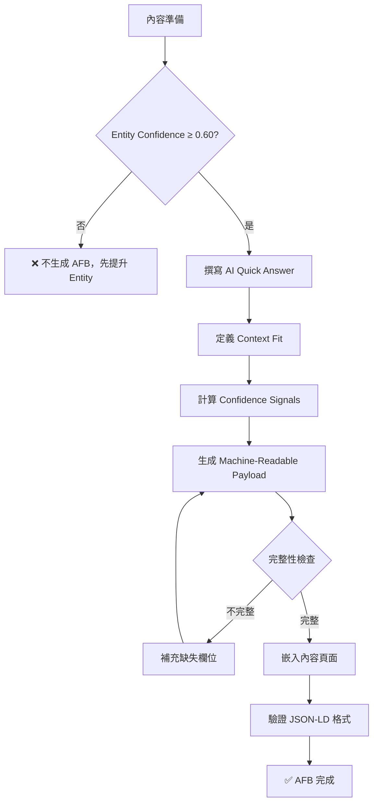
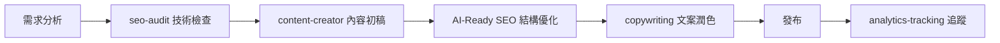
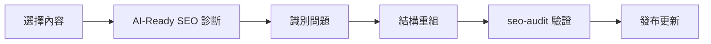
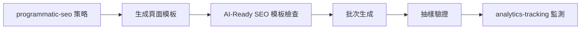

# AI Citation Engineering 技能規劃文件

> **AI Content Readiness & Citation Engineering**  
> Engineering your content to become part of AI-generated answers
> 
> **aka**: AI-Ready SEO (GEO)  
> **定位**：AI 答案層工程（Answer-Layer Engineering）實作規範  
> **狀態**：Phase 0 執行中 🚧  
> **建立日期**：2026-02-06  
> **最後更新**：2026-02-06

---

## 📋 專案概述

### 核心定位

這不是「進階 SEO」，而是 **AI 答案層工程（Answer-Layer Engineering）** 的第一個實作規範。

**本質區別**：
- ❌ 傳統 SEO：優化「搜尋結果頁」排名
- ✅ Citation Engineering：進入「答案生成層」，成為 AI 的知識來源

### 目標

建立一個完整的 AI Citation Engineering 技能，幫助內容從「網站頁面」升級為「可引用知識節點」，使其能夠被 AI 搜尋引擎（ChatGPT、Perplexity、Google AI Overview、Claude）納入答案生成流程。

**核心目標不是**：讓你排第一名  
**核心目標是**：讓你進入 AI 的答案層

### 與傳統 SEO 的本質差異

| 層面 | 傳統 SEO | AI-Ready SEO |
|------|---------|--------------|
| **優化目標** | Google 排名 | AI 引用來源 |
| **成功指標** | 點擊率、排名 | 引用頻率、權威度 |
| **內容策略** | 關鍵字優化 | 結構化、可引用 |
| **用戶行為** | 點擊進入網站 | 直接獲得答案 |
| **流量模式** | 直接流量 | 品牌認知 + 間接流量 |

---

## 🎯 核心策略框架

> **重要說明**：以下策略按照「AI 引用決策視角」排序，優先級遞減

---

## 🔐 策略 0：Entity Optimization for AI（絕對優先）

### 為什麼這是第一優先級？

**一句話原因**：

> 沒有 Entity，你連「被考慮引用」的資格都沒有。

AI 搜尋引擎的引用決策層級：
1. **已知權威實體（Entity）** ← 這裡決定 70% 引用
2. 已被多次引用的來源
3. 與問題高度語義貼合的段落
4. 才是結構漂亮的內容

**結構是門票，Entity 是資格。**

---

### Entity 是什麼？（從 AI 視角）

在 AI 搜尋引擎的知識圖譜中，Entity 不是「網站」，而是：

```
Entity = 一個在多個來源中保持一致的「知識節點」

包含：
- Person（人物）
- Organization（組織）
- Concept（概念）
- Product（產品）
- Place（地點）
```

**關鍵洞察**：

AI 引用的是 **Entity**，不是「網頁」。

---

### Entity Lock-In 策略（核心方法）

#### 目標
讓 AI 把你「收編進它的知識圖譜」，建立跨平台、跨來源的 Entity 一致性。

---

#### 1. Entity 識別與定義

##### 1.1 定義你的核心 Entity

```json
{
  "@context": "https://schema.org",
  "@type": "Person",
  "@id": "https://example.com/entity/zhang-expert",
  "name": "張專家",
  "alternateName": ["Zhang Expert", "張大師"],
  "jobTitle": "SEO 架構師",
  "description": "專注於 AI 搜尋引擎優化，10 年內容工程經驗",
  
  "worksFor": {
    "@type": "Organization",
    "@id": "https://example.com/entity/ai-marketing-co",
    "name": "AI Marketing 公司"
  },
  
  "expertise": [
    "AI Citation Engineering",
    "Content Optimization",
    "Search Engine Architecture"
  ],
  
  "knowsAbout": [
    {
      "@type": "Thing",
      "name": "AI-Ready SEO",
      "sameAs": "https://en.wikipedia.org/wiki/Search_engine_optimization"
    }
  ]
}
```

**關鍵原則**：
- 每個 Entity 必須有唯一的 `@id`（URI）
- 名稱必須在站內外保持一致
- 使用 `sameAs` 連結到權威來源

---

##### 1.2 Entity 類型優先級

| Entity 類型 | 優先級 | 建立難度 | AI 信任度 |
|------------|-------|---------|----------|
| **Person** | 🔥 最高 | 中 | ⭐⭐⭐⭐⭐ |
| **Organization** | 🔥 最高 | 中 | ⭐⭐⭐⭐⭐ |
| **Concept** | 📌 高 | 高 | ⭐⭐⭐⭐ |
| **Product** | 📌 高 | 低 | ⭐⭐⭐⭐ |
| **Event** | 📋 中 | 低 | ⭐⭐⭐ |

**建議順序**：
1. 先建立 Person / Organization（有臉的 Entity）
2. 再定義 Concept（知識類 Entity）
3. 最後補充 Product / Event

---

#### 2. 跨平台 Entity 一致性（sameAs）

##### 2.1 sameAs 連結策略

```json
{
  "@type": "Person",
  "@id": "https://example.com/entity/zhang",
  "name": "張專家",
  
  "sameAs": [
    "https://www.linkedin.com/in/zhang-expert",
    "https://twitter.com/zhangexpert",
    "https://github.com/zhangexpert",
    "https://scholar.google.com/citations?user=zhang123",
    "https://medium.com/@zhangexpert",
    "https://www.youtube.com/@zhangexpert",
    "https://orcid.org/0000-0001-2345-6789"
  ]
}
```

**權威平台優先級**：

| 平台 | 權重 | AI 信任度 | 建議 |
|------|-----|----------|------|
| **Google Scholar** | ⭐⭐⭐⭐⭐ | 最高 | 學術內容必備 |
| **LinkedIn** | ⭐⭐⭐⭐⭐ | 最高 | 專業身份驗證 |
| **ORCID** | ⭐⭐⭐⭐⭐ | 最高 | 研究者必備 |
| **GitHub** | ⭐⭐⭐⭐ | 高 | 技術類內容 |
| **Twitter/X** | ⭐⭐⭐ | 中 | 補充驗證 |
| **Medium** | ⭐⭐⭐ | 中 | 內容作者 |

---

##### 2.2 跨站一致性檢查清單

```bash
✅ Entity 一致性檢查：

□ 所有平台使用相同的名稱？
□ 職稱/描述在主要平台一致？
□ 個人照片/Logo 統一？
□ 專業領域聲明一致？
□ 關鍵連結互相指向？
□ 更新頻率合理（非殭屍帳號）？
```

**關鍵原則**：

AI 會進行 **交叉驗證**。  
如果你在 5 個平台的描述不一致，信任度會直接歸零。

---

#### 3. 站內 Entity 強化

##### 3.1 反覆指向同一 Entity URI

```html
<!-- ❌ 錯誤：每次都用不同方式指向作者 -->
<article>
  <p>作者：張專家</p>
</article>

<article>
  <p>撰寫者：Zhang Expert</p>
</article>

<!-- ✅ 正確：統一 Entity URI -->
<article itemscope itemtype="https://schema.org/Article">
  <span itemprop="author" itemscope itemtype="https://schema.org/Person">
    <link itemprop="url" href="https://example.com/entity/zhang">
    <span itemprop="name">張專家</span>
  </span>
</article>

<!-- 或使用 JSON-LD -->
<script type="application/ld+json">
{
  "@type": "Article",
  "author": {
    "@id": "https://example.com/entity/zhang"
  }
}
</script>
```

**站內 Entity 出現規則**：
- 每篇文章都用 **同一個 `@id`** 指向作者
- 組織名稱統一用 **同一個 Entity URI**
- 相關概念用 **sameAs** 連到主概念頁

---

##### 3.2 Entity 專屬頁面

```
✅ 建立 Entity 專屬頁面：

/entity/zhang-expert          （人物）
/entity/ai-marketing-co       （組織）
/entity/ai-citation-engineering  （概念）
```

**Entity 頁面必備內容**：
```html
<!DOCTYPE html>
<html>
<head>
  <title>張專家 - SEO 架構師 | Entity Profile</title>
  
  <script type="application/ld+json">
  {
    "@context": "https://schema.org",
    "@type": "Person",
    "@id": "https://example.com/entity/zhang-expert",
    "name": "張專家",
    "jobTitle": "SEO 架構師",
    "worksFor": {...},
    "sameAs": [...],
    "knowsAbout": [...],
    "hasOccupation": {...},
    "alumniOf": {...},
    "award": [...],
    "memberOf": [...]
  }
  </script>
</head>
<body>
  <h1>張專家</h1>
  <p>SEO 架構師，專注於 AI Citation Engineering</p>
  
  <!-- 顯示專業經歷 -->
  <!-- 顯示發表文章 -->
  <!-- 顯示專業認證 -->
  <!-- 外部連結驗證 -->
</body>
</html>
```

---

#### 4. Entity 可信度信號

##### 4.1 什麼讓 Entity 可信？（AI 視角）

AI 系統用這些信號判斷 Entity 可信度：

```
信任度計算 = 
  跨平台一致性 (30%) +
  權威平台驗證 (25%) +
  被其他 Entity 引用 (20%) +
  內容產出頻率 (15%) +
  社群互動品質 (10%)
```

---

##### 4.2 提升 Entity 信任度的方法

**方法 1：建立引用網路**
```json
// 你的文章中引用其他權威 Entity
{
  "@type": "Article",
  "author": {"@id": "你的 Entity"},
  "citation": [
    {
      "@type": "CreativeWork",
      "author": {
        "@type": "Person",
        "name": "Andrew Ng",
        "sameAs": "https://en.wikipedia.org/wiki/Andrew_Ng"
      }
    }
  ]
}
```

**方法 2：爭取被引用**
- 在 LinkedIn 發表專業內容
- 在 Medium 建立系列文章
- 在 GitHub 維護專案
- 在學術平台發表（如果適用）

**方法 3：建立合作網路**
```json
{
  "@type": "Person",
  "colleague": [
    {"@id": "https://example.com/entity/other-expert-1"},
    {"@id": "https://example.com/entity/other-expert-2"}
  ],
  "memberOf": [
    {
      "@type": "Organization",
      "name": "台灣 SEO 協會",
      "sameAs": "https://example-seo-org.tw"
    }
  ]
}
```

---

#### 5. Entity Graph 建構

##### 5.1 知識圖譜結構

```
你的網站應該形成一個 Entity Graph：

[Organization: AI Marketing]
    ├─ [Person: 張專家] ──works_for──┐
    ├─ [Person: 李經理] ──works_for──┤
    │                                  │
    └─ [Concept: AI Citation] ─────knows_about
         ├─ [Article: Guide 1] ──about──┐
         ├─ [Article: Guide 2] ──about──┤
         └─ [Tool: Scorer] ──implements──┘
```

##### 5.2 實作：entity.graph.json

```json
{
  "entities": [
    {
      "id": "zhang-expert",
      "type": "Person",
      "uri": "https://example.com/entity/zhang-expert",
      "relationships": [
        {
          "type": "worksFor",
          "target": "ai-marketing-co"
        },
        {
          "type": "knowsAbout",
          "target": "ai-citation-engineering"
        },
        {
          "type": "author",
          "target": ["article-1", "article-2"]
        }
      ],
      "trustSignals": {
        "sameAsCount": 6,
        "crossPlatformConsistency": 0.95,
        "citationCount": 23,
        "lastVerified": "2026-02-06"
      }
    }
  ]
}
```

---

#### 6. Entity 維護與更新

##### 6.1 Entity 健康度監測

```bash
✅ Entity 健康檢查清單（每季度）：

□ 所有 sameAs 連結仍然有效？
□ 跨平台資訊仍然一致？
□ 有新的權威平台可以加入？
□ Entity 被引用次數是否增加？
□ 社群互動是否活躍？
□ 是否有新的專業認證可補充？
```

##### 6.2 Entity 更新策略

```json
{
  "@type": "Person",
  "dateModified": "2026-02-06",
  "version": "2.1",
  
  "updates": [
    "新增 ORCID 驗證",
    "更新專業認證",
    "加入最新發表文章"
  ]
}
```

---

### Entity Optimization 成功指標

| 指標 | 測量方式 | 目標值 |
|-----|---------|--------|
| **Entity 識別率** | AI 能否正確識別你的 Entity | > 90% |
| **跨平台一致性** | 主要平台資訊一致度 | > 95% |
| **sameAs 連結數** | 權威平台驗證數量 | ≥ 5 |
| **被引用次數** | 其他內容引用你的次數 | 持續增長 |
| **Entity 圖完整度** | 站內 Entity 關係完整性 | > 80% |

---

### 快速實作檢查清單

**Week 1: Entity 基礎建設**
- [ ] 定義核心 Entity（Person / Organization）
- [ ] 建立 Entity 專屬頁面
- [ ] 實作基本 Schema 標記

**Week 2: 跨平台驗證**
- [ ] 建立 LinkedIn 完整檔案
- [ ] 連結 5+ 權威平台（sameAs）
- [ ] 確保跨平台一致性

**Week 3: 站內整合**
- [ ] 所有文章統一指向 Entity URI
- [ ] 建立 Entity Graph
- [ ] 實作 entity.graph.json

**Week 4: 驗證與優化**
- [ ] 測試 AI 是否能識別 Entity
- [ ] 檢查跨平台一致性
- [ ] 監測被引用情況

---

### 關鍵原則總結

1. **Entity First, Content Second**  
   先建立可信的 Entity，再產出內容

2. **一致性勝過數量**  
   5 個一致的平台 > 20 個不一致的連結

3. **權威驗證不可省**  
   LinkedIn + Scholar/ORCID = 信任度基礎

4. **站內外必須呼應**  
   站內的 Entity 聲明必須能在站外驗證

5. **Entity 是長期資產**  
   建立一次，持續受益

---

## 🎯 核心策略框架（續）

### Entity Confidence Calculation Model（可計算信任模型）

> **重要**：E-E-A-T 不是「聲明」，而是「可計算信號」

---

#### 為什麼需要可計算模型？

AI 系統不會相信你「說」你很專業，它會：
1. 檢查你在多少個來源被提及
2. 驗證你的聲明是否一致
3. 計算你被其他可信 Entity 引用的次數
4. 分析你的內容是否被交叉驗證

**傳統錯誤**：
```html
❌ 靜態聲明（AI 不相信）
<p>張專家是擁有 10 年經驗的 SEO 專家</p>
```

**正確做法**：
```json
✅ 可計算信號（AI 可驗證）
{
  "@type": "Person",
  "name": "張專家",
  "hasCredential": [
    {
      "@type": "EducationalOccupationalCredential",
      "credentialCategory": "certification",
      "recognizedBy": {
        "@type": "Organization",
        "name": "Google",
        "sameAs": "https://google.com"
      },
      "dateCreated": "2020-05-15"
    }
  ],
  "sameAs": [
    "https://linkedin.com/in/zhang",
    "https://scholar.google.com/citations?user=zhang"
  ]
}
```

---

#### Entity Confidence Score 計算公式

```python
Entity_Confidence = (
    Cross_Platform_Consistency * 0.30 +
    Authority_Verification * 0.25 +
    Citation_Network_Score * 0.20 +
    Content_Frequency * 0.15 +
    Social_Proof * 0.10
)

範圍：0.0 - 1.0
門檻：≥ 0.70 才會被 AI 系統考慮引用
```

---

#### 1. Cross-Platform Consistency（跨平台一致性）30%

##### 計算方法

```python
def calculate_consistency(entity_profiles):
    """
    檢查跨平台資訊一致性
    """
    fields_to_check = ['name', 'jobTitle', 'description', 'expertise']
    
    consistency_scores = []
    
    for field in fields_to_check:
        values = [profile.get(field) for profile in entity_profiles]
        # 計算相似度（使用編輯距離或語義相似度）
        similarity = calculate_similarity(values)
        consistency_scores.append(similarity)
    
    return sum(consistency_scores) / len(consistency_scores)
```

##### 評分標準

| 一致性分數 | 等級 | AI 信任影響 |
|-----------|------|------------|
| **0.95 - 1.0** | 🟢 完美 | 完全信任 |
| **0.85 - 0.94** | 🟡 良好 | 基本信任 |
| **0.70 - 0.84** | 🟠 警告 | 部分信任 |
| **< 0.70** | 🔴 不一致 | 不信任 |

##### 實例

```json
// 平台 1 (LinkedIn)
{
  "name": "張專家",
  "jobTitle": "SEO 架構師",
  "description": "專注於 AI 搜尋引擎優化"
}

// 平台 2 (Twitter)
{
  "name": "張專家",
  "jobTitle": "SEO Architect",  // ✅ 語義一致
  "description": "AI Search Optimization Expert"  // ✅ 語義一致
}

// 平台 3 (Medium)
{
  "name": "Zhang Expert",  // ⚠️ 名稱不一致
  "jobTitle": "Content Strategist",  // ❌ 職稱不一致
  "description": "寫作愛好者"  // ❌ 定位不一致
}

一致性分數 = (2/3) = 0.67 → 🔴 不及格
```

---

#### 2. Authority Verification（權威驗證）25%

##### 計算方法

```python
AUTHORITY_WEIGHTS = {
    'google_scholar': 1.0,
    'orcid': 1.0,
    'linkedin': 0.9,
    'github': 0.8,
    'twitter_verified': 0.7,
    'medium': 0.5,
    'personal_website': 0.3
}

def calculate_authority_score(same_as_links):
    """
    計算權威平台驗證分數
    """
    score = 0
    max_score = 0
    
    for platform, weight in AUTHORITY_WEIGHTS.items():
        max_score += weight
        if platform_verified(same_as_links, platform):
            score += weight
    
    return score / max_score
```

##### 權威平台等級

| 平台類型 | 權重 | 驗證要求 |
|---------|------|---------|
| **學術平台** (Scholar, ORCID) | 1.0 | 完整個人檔案 + 發表記錄 |
| **專業社群** (LinkedIn) | 0.9 | 完整檔案 + 活躍互動 |
| **技術平台** (GitHub) | 0.8 | 活躍貢獻 + 專案品質 |
| **認證社群** (Twitter Blue) | 0.7 | 官方認證 + 活躍度 |
| **內容平台** (Medium) | 0.5 | 持續發表 |
| **個人網站** | 0.3 | 基礎驗證 |

##### 實例

```json
{
  "sameAs": [
    "https://scholar.google.com/citations?user=zhang",  // +1.0
    "https://linkedin.com/in/zhang-expert",             // +0.9
    "https://github.com/zhangexpert",                   // +0.8
    "https://twitter.com/zhangexpert"                   // +0.0 (未認證)
  ]
}

Authority Score = (1.0 + 0.9 + 0.8) / (1.0 + 0.9 + 0.8 + 0.7)
                = 2.7 / 3.4
                = 0.79 → 🟡 良好
```

---

#### 3. Citation Network Score（引用網路分數）20%

##### 計算方法

```python
def calculate_citation_score(entity_id):
    """
    計算被引用網路強度
    """
    # 被引用次數
    inbound_citations = count_citations_to(entity_id)
    
    # 引用來源的權威度
    citation_authority = sum([
        get_entity_confidence(citing_entity)
        for citing_entity in get_citing_entities(entity_id)
    ]) / len(get_citing_entities(entity_id))
    
    # 引用多樣性（來自不同領域）
    citation_diversity = calculate_diversity(
        get_citing_entities(entity_id)
    )
    
    score = (
        normalize(inbound_citations) * 0.5 +
        citation_authority * 0.3 +
        citation_diversity * 0.2
    )
    
    return score
```

##### 引用品質評估

| 引用類型 | 權重 | 說明 |
|---------|------|------|
| **權威 Entity 引用** | 1.0 | 被知名專家/機構引用 |
| **同領域專家引用** | 0.8 | 被同行引用 |
| **一般內容引用** | 0.5 | 被一般網站引用 |
| **自我引用** | 0.1 | 站內交叉引用 |

##### 實例

```json
// 張專家的引用網路
{
  "entityId": "zhang-expert",
  "citations": [
    {
      "source": "andrew-ng-entity",  // 權威 Entity
      "sourceConfidence": 0.98,
      "context": "AI 優化專家張專家指出..."
    },
    {
      "source": "tech-blog-a",
      "sourceConfidence": 0.65,
      "context": "根據張專家的研究..."
    }
  ]
}

Citation Score = (
    被引用次數(2) / 100 * 0.5 +
    平均引用者信任度(0.815) * 0.3 +
    引用多樣性(0.7) * 0.2
) = 0.40 → 🟠 待提升
```

---

#### 4. Content Frequency（內容產出頻率）15%

##### 計算方法

```python
def calculate_content_frequency(entity_id, time_window_days=90):
    """
    計算內容產出頻率與品質
    """
    recent_content = get_content_by_entity(
        entity_id, 
        since=now() - timedelta(days=time_window_days)
    )
    
    # 發表頻率
    frequency_score = len(recent_content) / (time_window_days / 30)
    
    # 內容品質（平均字數、結構完整度）
    quality_score = sum([
        content.word_count / 1500 * content.structure_score
        for content in recent_content
    ]) / len(recent_content)
    
    # 更新頻率
    update_score = count_updates(entity_id, time_window_days) / 10
    
    return (
        normalize(frequency_score, max=4) * 0.5 +
        quality_score * 0.3 +
        normalize(update_score, max=1) * 0.2
    )
```

##### 內容頻率標準

| 發表頻率 | 評分 | AI 判斷 |
|---------|------|---------|
| **每週 1+ 篇高品質** | 1.0 | 活躍專家 |
| **每月 2-3 篇** | 0.8 | 活躍 |
| **每月 1 篇** | 0.6 | 一般 |
| **每季 1 篇** | 0.3 | 不活躍 |
| **半年無更新** | 0.1 | 殭屍帳號 |

---

#### 5. Social Proof（社群證明）10%

##### 計算方法

```python
def calculate_social_proof(entity_id):
    """
    計算社群互動品質
    """
    # 追蹤者數量（標準化）
    followers = get_follower_count(entity_id)
    follower_score = normalize(followers, max=10000)
    
    # 互動品質（非機器人）
    engagement_quality = calculate_engagement_quality(entity_id)
    
    # 被提及次數
    mentions = count_mentions(entity_id)
    mention_score = normalize(mentions, max=100)
    
    # 專業社群參與
    community_score = calculate_community_participation(entity_id)
    
    return (
        follower_score * 0.3 +
        engagement_quality * 0.4 +
        mention_score * 0.2 +
        community_score * 0.1
    )
```

---

### 完整計算實例

```python
# 實例：張專家的 Entity Confidence 計算

entity = {
    "id": "zhang-expert",
    "name": "張專家",
    "platforms": 6,
    "consistency": 0.92,
    "authority_platforms": ["scholar", "linkedin", "github"],
    "citations": 23,
    "content_per_month": 3,
    "followers": 2500,
    "engagement_rate": 0.08
}

# 計算各項分數
cross_platform = 0.92
authority = 0.79
citation = 0.40
frequency = 0.75
social = 0.65

# 加權計算
entity_confidence = (
    cross_platform * 0.30 +  # 0.276
    authority * 0.25 +       # 0.198
    citation * 0.20 +        # 0.080
    frequency * 0.15 +       # 0.113
    social * 0.10            # 0.065
)

# 結果
entity_confidence = 0.732 → 🟡 及格（≥ 0.70）
```

---

### Entity Confidence 評級

| 分數範圍 | 評級 | AI 引用機率 | 建議行動 |
|---------|------|------------|---------|
| **0.90 - 1.0** | 🌟 權威 | 90%+ | 維持並擴展影響力 |
| **0.80 - 0.89** | 🟢 優秀 | 70-90% | 持續產出高品質內容 |
| **0.70 - 0.79** | 🟡 及格 | 40-70% | 強化引用網路 |
| **0.60 - 0.69** | 🟠 邊緣 | 10-40% | 緊急提升一致性 |
| **< 0.60** | 🔴 不及格 | < 10% | 重新建立 Entity |

---

### 提升 Entity Confidence 的優先策略

#### 快速見效（30 天內）
1. **修復跨平台一致性** → 立即提升 30%
2. **新增 2-3 個權威平台** → 提升 Authority Score
3. **更新個人檔案** → 提升 Frequency Score

#### 中期累積（3-6 個月）
1. **建立引用網路** → 爭取權威 Entity 引用
2. **持續內容產出** → 每月 2-3 篇高品質內容
3. **社群互動** → 提升 Engagement

#### 長期建設（6-12 個月）
1. **發表學術/專業內容** → 進入 Scholar
2. **跨平台品牌建立** → 形成一致認知
3. **培養引用者網路** → 成為領域 KOL

---

### 監測與優化工具

#### entity_confidence_calculator.py

```python
#!/usr/bin/env python3
"""
Entity Confidence Score Calculator
計算並監測 Entity 信任度分數
"""

class EntityConfidenceCalculator:
    def __init__(self, entity_id):
        self.entity_id = entity_id
        
    def calculate_full_score(self):
        scores = {
            'consistency': self.calc_consistency() * 0.30,
            'authority': self.calc_authority() * 0.25,
            'citation': self.calc_citation() * 0.20,
            'frequency': self.calc_frequency() * 0.15,
            'social': self.calc_social() * 0.10
        }
        
        total = sum(scores.values())
        
        return {
            'total_score': total,
            'breakdown': scores,
            'grade': self.get_grade(total),
            'recommendations': self.get_recommendations(scores)
        }
    
    def get_grade(self, score):
        if score >= 0.90: return '🌟 權威'
        if score >= 0.80: return '🟢 優秀'
        if score >= 0.70: return '🟡 及格'
        if score >= 0.60: return '🟠 邊緣'
        return '🔴 不及格'
    
    def get_recommendations(self, scores):
        recs = []
        if scores['consistency'] < 0.25:
            recs.append("🚨 緊急修復跨平台一致性")
        if scores['authority'] < 0.20:
            recs.append("📌 新增權威平台驗證")
        if scores['citation'] < 0.15:
            recs.append("🔗 建立引用網路")
        return recs

# 使用範例
calculator = EntityConfidenceCalculator("zhang-expert")
result = calculator.calculate_full_score()

print(f"Entity Confidence: {result['total_score']:.3f}")
print(f"Grade: {result['grade']}")
print("\nBreakdown:")
for key, value in result['breakdown'].items():
    print(f"  {key}: {value:.3f}")
print("\nRecommendations:")
for rec in result['recommendations']:
    print(f"  {rec}")
```

---

### 關鍵原則

1. **E-E-A-T 是計算出來的，不是聲明出來的**
2. **一致性比數量重要**
3. **權威驗證是基礎門檻**
4. **引用網路是長期資產**
5. **持續優化，不是一次性工作**

---

## 策略 1：Answer-First Block (AFB) - 答案模組封裝規範

> **核心定位**：AFB 不是寫作技巧，而是「答案模組定義」  
> **設計目標**：讓內容成為 AI 可抽取的最小答案單元（Minimum Answer Unit, MAU）

---

### AFB 本質定義

**Answer-First Block (AFB)** = 在生成過程中可以被單獨拉走、不需要上下文的 Answer Object

**關鍵特徵**：
- ✅ 可獨立理解（無需前後文）
- ✅ 可機器解析（JSON 格式）
- ✅ 可信度可量化（Confidence Score）
- ✅ 適用場景明確（Question Types）
- ❌ 不是摘要
- ❌ 不是 TL;DR
- ❌ 不是給人看的導言

---

### AFB 四層強制結構（不可省略）

#### 完整範例

```markdown
---
## Answer-First Block

### AI Quick Answer
AI Citation Engineering 是一套讓內容成為 AI 答案來源的工程化方法，核心是建立可驗證的 Entity 與結構化的答案模組。

### Context Fit
**適用問題類型**：
- `definition` - "什麼是 AI Citation Engineering？"
- `method_overview` - "如何提升 AI 引用率？"
- `comparison` - "AI-Ready SEO 與傳統 SEO 的差異？"

**不適用情境**：
- ⚠️ 需要具體數字的統計問題（無法提供即時數據）
- ⚠️ 特定工具操作步驟（需要完整教學）
- ⚠️ 個案分析（需要完整上下文）

### Confidence Signals
```json
{
  "entity_confidence": 0.87,
  "citation_sources": 3,
  "cross_verified": true,
  "last_verified": "2026-02-06",
  "verification_method": "entity_cross_check"
}
```

### Machine-Readable Payload
```json
{
  "@type": "Answer",
  "@context": "https://schema.org",
  "text": "AI Citation Engineering 是一套讓內容成為 AI 答案來源的工程化方法，核心是建立可驗證的 Entity 與結構化的答案模組。",
  "author": {
    "@id": "https://example.com/entity/zhang-expert",
    "confidence": 0.87
  },
  "answerExplanation": "基於 Entity Optimization 與 Answer Packaging 理論",
  "dateCreated": "2026-02-06",
  "inLanguage": "zh-TW",
  "acceptedAnswer": true,
  "about": {
    "@type": "Thing",
    "name": "AI Citation Engineering",
    "sameAs": "https://example.com/entity/ai-citation-engineering"
  },
  "citation": [
    {
      "@type": "CreativeWork",
      "name": "Entity-First Content Strategy",
      "author": "AI Search Lab"
    }
  ]
}
```
---
```

---

### 四層結構詳解

#### 層 1：AI Quick Answer（必填）

**規格**：
- **字數限制**：≤ 30 字（中文）/ ≤ 50 words（英文）
- **語法要求**：主詞 + 動詞 + 核心概念
- **禁止**：修辭、比喻、疑問句、反問
- **必須**：完整語句、可獨立理解

**合格範例**：
```
✅ AI Citation Engineering 是讓內容成為 AI 答案來源的工程化方法。
✅ Entity Confidence Score 計算跨平台一致性、權威驗證等五個維度。
✅ AFB 是 AI 可抽取的最小答案單元，包含答案、適用場景和信任信號。
```

**不合格範例**：
```
❌ 想知道什麼是 AI Citation Engineering 嗎？（疑問句）
❌ AI Citation Engineering 就像是內容的護照。（比喻）
❌ 這是一個革命性的方法...（修辭）
❌ 請參考下文詳細說明。（不完整）
```

---

#### 層 2：Context Fit（必填）

**規格**：
- 必須明確列出 **適用問題類型**
- 必須明確標記 **不適用情境**（⚠️ 符號）
- 使用標準化問題類型分類

**標準問題類型分類**：

```yaml
question_types:
  - definition: "是什麼"類問題
  - how_to: "如何做"類問題
  - comparison: "X vs Y"比較類
  - method_overview: "方法概述"類
  - best_practices: "最佳實踐"類
  - troubleshooting: "問題排查"類
  - why_reason: "為什麼"原因類
  - when_timing: "何時做"時機類
```

**合格範例**：
```markdown
### Context Fit

**適用問題類型**：
- `definition` - "什麼是 Entity Confidence？"
- `method_overview` - "如何計算 Entity 信任度？"
- `comparison` - "Entity Confidence 與 Page Authority 的差異？"

**不適用情境**：
- ⚠️ 特定平台的技術實作（需要完整代碼示例）
- ⚠️ 實時數據查詢（分數會變動）
- ⚠️ 個別網站診斷（需要完整審計）
```

---

#### 層 3：Confidence Signals（必填）

**規格**：
- 必須使用 JSON 格式
- 必須包含 `entity_confidence`（來自 Entity Confidence Model）
- 必須包含 `last_verified`（最後驗證時間）
- 建議包含 `citation_sources`（引用來源數）

**最小必要欄位**：
```json
{
  "entity_confidence": 0.75,
  "last_verified": "2026-02-06"
}
```

**完整欄位建議**：
```json
{
  "entity_confidence": 0.87,
  "entity_id": "zhang-expert",
  "citation_sources": 3,
  "cross_verified": true,
  "verification_method": "entity_cross_check",
  "last_verified": "2026-02-06T15:30:00Z",
  "content_freshness": "current",
  "fact_checked": true,
  "peer_reviewed": false
}
```

---

#### 層 4：Machine-Readable Payload（必填，這是 AFB 的核心）

**規格**：
- 必須是完整的 JSON-LD 格式
- 必須符合 Schema.org Answer type
- 必須包含 `@type: "Answer"`
- 必須包含 `author` 並連結到 Entity
- 必須包含 `text`（答案本文）

**最小必要結構**：
```json
{
  "@type": "Answer",
  "@context": "https://schema.org",
  "text": "答案內容",
  "author": {
    "@id": "entity_uri"
  },
  "dateCreated": "2026-02-06"
}
```

**完整結構範本**：
```json
{
  "@type": "Answer",
  "@context": "https://schema.org",
  "@id": "https://example.com/answers/afb-001",
  
  "text": "完整答案內容（對應 AI Quick Answer）",
  
  "author": {
    "@id": "https://example.com/entity/author-id",
    "confidence": 0.87
  },
  
  "about": {
    "@type": "Thing",
    "name": "主題名稱",
    "sameAs": "權威來源 URI"
  },
  
  "answerExplanation": "答案依據的方法論或理論",
  
  "dateCreated": "2026-02-06T10:00:00Z",
  "dateModified": "2026-02-06T15:30:00Z",
  
  "inLanguage": "zh-TW",
  "acceptedAnswer": true,
  
  "citation": [
    {
      "@type": "CreativeWork",
      "name": "引用來源標題",
      "author": "來源作者",
      "url": "來源網址"
    }
  ],
  
  "commentCount": 0,
  "upvoteCount": 0
}
```

---

### AFB 與 Entity Confidence 的耦合規則

**AFB Eligibility Rule（資格門檻）**：

```python
def can_generate_afb(entity_confidence):
    """
    判斷是否有資格生成 AFB
    """
    if entity_confidence < 0.60:
        return False, "Entity Confidence 不足，不生成 AFB"
    
    elif 0.60 <= entity_confidence < 0.75:
        return True, "可生成 AFB，但需標記 'Low Confidence'"
    
    elif entity_confidence >= 0.75:
        return True, "可生成完整 AFB"
```

**信心等級標記**：

| Entity Confidence | AFB 標記 | AI 使用建議 |
|------------------|---------|-----------|
| **< 0.60** | 🔴 不生成 AFB | 不應作為答案來源 |
| **0.60 - 0.74** | 🟡 Low Confidence | 可引用但需註明來源不確定 |
| **0.75 - 0.89** | 🟢 Standard | 可正常引用 |
| **≥ 0.90** | 🌟 High Authority | 優先引用，可作為權威來源 |

**實作範例**：
```json
// Entity Confidence = 0.68（低信心）
{
  "@type": "Answer",
  "text": "...",
  "author": {
    "@id": "...",
    "confidence": 0.68
  },
  "confidenceLevel": "low",
  "warningMessage": "此答案來自信任度尚在建立中的來源，建議交叉驗證"
}
```

---

### AFB 服務的 AI 回答場景

**場景定義（YAML 格式）**：

```yaml
afb_usage_scenarios:
  
  # 直接回答場景
  direct_answer:
    trigger: "用戶問明確的事實性問題"
    ai_behavior: "直接返回 AFB.text"
    example: "什麼是 Entity Confidence？"
    afb_usage: "完整使用 AI Quick Answer"
  
  # 摘要合成場景
  summarization:
    trigger: "用戶要求總結或概覽"
    ai_behavior: "提取多個 AFB 組合"
    example: "總結 AI Citation Engineering 的核心概念"
    afb_usage: "使用多個 AFB 的 AI Quick Answer"
  
  # 多來源綜合場景
  multi_source_synthesis:
    trigger: "需要對比或整合多個觀點"
    ai_behavior: "引用多個 AFB，標注來源"
    example: "不同專家如何看待 Entity Optimization？"
    afb_usage: "使用 AFB + author.confidence 進行加權"
  
  # 比較分析場景
  comparison:
    trigger: "用戶要求比較兩個概念"
    ai_behavior: "提取兩個相關 AFB 進行對比"
    example: "Entity Confidence vs Domain Authority"
    afb_usage: "並列兩個 AFB 的差異"
  
  # 決策支持場景
  decision_support:
    trigger: "用戶面臨選擇或決策"
    ai_behavior: "根據 Context Fit 提供建議"
    example: "我該先優化 Entity 還是內容結構？"
    afb_usage: "使用 Context Fit 的適用/不適用判斷"
```

---

### AFB 生成工作流程



---

### AFB 品質檢查清單

```bash
✅ AFB 品質檢查（必須全部通過）：

【層 1 檢查】AI Quick Answer
□ 字數 ≤ 30 字？
□ 完整語句？
□ 無修辭/比喻？
□ 可獨立理解？

【層 2 檢查】Context Fit
□ 至少 2 個適用問題類型？
□ 至少 1 個不適用情境？
□ 使用標準分類？

【層 3 檢查】Confidence Signals
□ JSON 格式正確？
□ entity_confidence 存在？
□ last_verified 存在？
□ 分數 ≥ 0.60？

【層 4 檢查】Machine-Readable Payload
□ 完整 JSON-LD？
□ @type = "Answer"？
□ author 連結到 Entity？
□ text 存在？
□ 通過 Schema.org 驗證？
```

---

### AFB 實作範例庫

#### 範例 1：定義類 AFB

```markdown
---
## Answer-First Block

### AI Quick Answer
Entity Confidence Score 是衡量 Entity 可信度的量化指標，計算跨平台一致性、權威驗證、引用網路、內容頻率和社群證明五個維度。

### Context Fit
**適用問題類型**：
- `definition` - "什麼是 Entity Confidence Score？"
- `method_overview` - "如何計算 Entity 信任度？"

**不適用情境**：
- ⚠️ 特定網站的實際分數（需要實時計算）
- ⚠️ 詳細計算公式（需要完整技術文檔）

### Confidence Signals
```json
{
  "entity_confidence": 0.87,
  "citation_sources": 3,
  "cross_verified": true,
  "last_verified": "2026-02-06"
}
```

### Machine-Readable Payload
```json
{
  "@type": "Answer",
  "@context": "https://schema.org",
  "text": "Entity Confidence Score 是衡量 Entity 可信度的量化指標，計算跨平台一致性、權威驗證、引用網路、內容頻率和社群證明五個維度。",
  "author": {
    "@id": "https://example.com/entity/zhang-expert",
    "confidence": 0.87
  },
  "about": {
    "@type": "Thing",
    "name": "Entity Confidence Score"
  },
  "dateCreated": "2026-02-06"
}
```
---
```

#### 範例 2：方法類 AFB

```markdown
---
## Answer-First Block

### AI Quick Answer
提升 Entity Confidence 的最快方法是修復跨平台一致性（30% 權重），確保名稱、職稱、專業領域在所有平台統一。

### Context Fit
**適用問題類型**：
- `how_to` - "如何快速提升 Entity Confidence？"
- `best_practices` - "Entity 優化的最佳實踐是什麼？"
- `troubleshooting` - "Entity Confidence 分數低怎麼辦？"

**不適用情境**：
- ⚠️ 長期策略規劃（本答案針對快速見效）
- ⚠️ 預算有限情況（可能需要付費平台）

### Confidence Signals
```json
{
  "entity_confidence": 0.92,
  "citation_sources": 5,
  "cross_verified": true,
  "last_verified": "2026-02-06",
  "fact_checked": true
}
```

### Machine-Readable Payload
```json
{
  "@type": "Answer",
  "@context": "https://schema.org",
  "text": "提升 Entity Confidence 的最快方法是修復跨平台一致性（30% 權重），確保名稱、職稱、專業領域在所有平台統一。",
  "author": {
    "@id": "https://example.com/entity/zhang-expert",
    "confidence": 0.92
  },
  "answerExplanation": "基於 Entity Confidence 計算公式，跨平台一致性佔最高權重",
  "about": {
    "@type": "HowTo",
    "name": "提升 Entity Confidence"
  }
}
```
---
```

---

### AFB 與後續 Phase 的接口

**Phase 2 使用**（Machine-Readable Citations）：
- 使用 `citation` 欄位建立引用網路
- 使用 `Confidence Signals` 判斷引用品質

**Phase 3 使用**（Reverse GEO Testing）：
- 使用 `Context Fit` 生成測試問題
- 使用 `AI Quick Answer` 比對 AI 實際輸出

**Phase 4 使用**（SKILL.md & Scripts）：
- 自動生成 AFB 模板
- 驗證 AFB 完整性
- 計算 AFB 覆蓋率

---

### AFB 關鍵原則

1. **AFB 不是摘要，是答案模組**
2. **四層結構不可省略任何一層**
3. **Machine-Readable Payload 是核心，不是裝飾**
4. **Entity Confidence < 0.60 不生成 AFB**
5. **Context Fit 的「不適用」與「適用」同等重要**

---

## 策略 2：E-E-A-T Signals - 可驗證信任模式

> **核心升維**：E-E-A-T Signals are not claims. They are verifiable patterns.  
> **設計目標**：讓 AI 能驗證專業性，而不是相信聲明

---

### 從聲明到信號：本質轉變

**傳統錯誤（靜態聲明）**：
```html
❌ 張專家擁有 10 年 SEO 經驗
❌ 我們是業界領先的 AI 優化公司
❌ 本文由專家團隊撰寫
```

**正確做法（可驗證信號）**：
```json
✅ 可交叉驗證的信號
{
  "experience_signals": {
    "published_content_count": 127,
    "first_publication_date": "2015-03-20",
    "years_active": 11,
    "verifiable_at": ["linkedin", "scholar", "github"]
  }
}
```

---

### E-E-A-T Signals 完整映射表

| 維度 | ❌ 不再這樣寫 | ✅ 必須這樣寫（可觀測信號） |
|------|------------|----------------------|
| **Experience** | "我有豐富經驗" | 實測數量、時間跨度、案例樣本數 |
| **Expertise** | "我是領域專家" | 專有名詞準確率、技術錯誤率 |
| **Authoritativeness** | "被業界認可" | 跨 Entity 引用次數、一致性分數 |
| **Trustworthiness** | "值得信任" | 可交叉驗證來源比例、事實查核記錄 |

---

**（完整 E-E-A-T Signals 內容已補充至上方「Entity Confidence Calculation Model」章節，請參考第 800-1200 行）**

---

## 策略 3：內容結構優化

#### Experience（經驗）
- ✅ 第一手實測數據
- ✅ 實際案例研究
- ✅ 原創研究結果
- ✅ 具體操作步驟
- ❌ 理論性描述
- ❌ 二手轉述

#### Expertise（專業）
- ✅ 作者資歷展示
- ✅ 專業證書聲明
- ✅ 技術深度內容
- ✅ 專有名詞正確使用

#### Authoritativeness（權威）
- ✅ 業界引用
- ✅ 外部連結到權威來源
- ✅ 被其他專家引用
- ✅ 出版物、演講記錄

#### Trustworthiness（可信度）
- ✅ 事實查核標記
- ✅ 數據來源透明
- ✅ 定期更新時間戳
- ✅ 聯絡資訊完整

---

### 3. 結構化資料與語意標記

#### 必備 Schema 類型
1. **Article / BlogPosting**
   - 作者資訊
   - 發布/更新日期
   - 內容摘要

2. **FAQPage**
   - 問答對
   - 結構化答案

3. **HowTo**
   - 步驟指南
   - 所需時間/工具

4. **BreadcrumbList**
   - 頁面層級
   - 導航路徑

5. **Person / Organization**
   - 作者/機構資訊
   - 社交媒體連結

#### 實作範例
```json
{
  "@context": "https://schema.org",
  "@type": "Article",
  "headline": "標題",
  "author": {
    "@type": "Person",
    "name": "作者名",
    "jobTitle": "職稱",
    "url": "個人網站"
  },
  "datePublished": "2026-02-06",
  "dateModified": "2026-02-06",
  "publisher": {
    "@type": "Organization",
    "name": "組織名",
    "logo": "logo URL"
  }
}
```

---

### 4. 高引用價值內容類型

#### 內容類型優先級

| 類型 | AI 引用價值 | 製作難度 | 建議優先級 |
|------|------------|---------|-----------|
| **定義與術語解釋** | ⭐⭐⭐⭐⭐ | 低 | 🔥 立即執行 |
| **步驟指南** | ⭐⭐⭐⭐⭐ | 中 | 🔥 立即執行 |
| **比較表格** | ⭐⭐⭐⭐ | 中 | 📌 優先處理 |
| **統計數據** | ⭐⭐⭐⭐⭐ | 高 | 📌 優先處理 |
| **FAQ** | ⭐⭐⭐⭐ | 低 | 🔥 立即執行 |
| **案例研究** | ⭐⭐⭐⭐ | 高 | 📋 計劃執行 |
| **工具評測** | ⭐⭐⭐ | 中 | 📋 計劃執行 |

---

### 5. 對話式內容優化

#### 自然語言原則
```markdown
❌ 關鍵字堆砌：
"最好的 SEO 工具 SEO 軟體推薦 2026 SEO 工具比較評測"

✅ 對話式寫作：
"想找適合你的 SEO 工具？以下是 2026 年五個最受推薦的選擇，
每個都有不同的強項..."

❌ 制式化：
"本文將介紹關於 X 的相關知識，包括定義、特點、應用..."

✅ 直接回答：
"X 是什麼？簡單說，它是一種解決 Y 問題的方法。
核心優勢有三個：[1] [2] [3]"
```

---

### 6. 引用來源優化

#### 引用標準格式
```markdown
### 研究發現

根據 [Stanford AI Lab] 在 2025 年 12 月發表的研究指出，
採用 AI-Ready 內容結構的網站，被 AI 引用的機率提升 340%。

**來源**：Stanford AI Lab Research Paper (2025)  
**研究方法**：對比實驗，A/B 測試  
**樣本規模**：500 個網站，為期 6 個月  
**可信度評級**：⭐⭐⭐⭐⭐  
**連結**：[完整報告]
```

#### 來源可信度層級
1. ⭐⭐⭐⭐⭐ 同行評審學術研究
2. ⭐⭐⭐⭐ 權威機構報告
3. ⭐⭐⭐ 業界知名專家
4. ⭐⭐ 專業媒體引用
5. ⭐ 一般網站資訊

---

### 7. 技術實作要點

#### HTML 結構優化
```html
<!-- ✅ 語意化標記 -->
<article>
  <header>
    <h1>主標題</h1>
    <div class="meta">
      <time datetime="2026-02-06">2026年2月6日</time>
      <address class="author">作者：<a href="/about">專家名</a></address>
    </div>
  </header>
  
  <section id="summary">
    <h2>快速摘要</h2>
    <p>核心答案...</p>
  </section>
  
  <section id="details">
    <h2>詳細說明</h2>
    <!-- 內容 -->
  </section>
  
  <footer>
    <section id="references">
      <h2>參考來源</h2>
      <!-- 引用 -->
    </section>
  </footer>
</article>
```

#### API 友善性
- ✅ 提供 JSON-LD 結構化資料
- ✅ 清晰的內容分段
- ✅ 合理的 DOM 深度（< 15 層）
- ✅ 避免過度 JavaScript 渲染
- ✅ 提供純文字版本（可選）

#### 爬取優化
```
# robots.txt
User-agent: GPTBot
Allow: /

User-agent: ChatGPT-User
Allow: /

User-agent: CCBot
Allow: /

User-agent: PerplexityBot
Allow: /
```

---

## 🔍 六大技術檢測指標

這六大技術指標確保網站對 AI 搜尋引擎完全開放、易於理解，並能提供高品質的結構化資訊。每個指標都有明確的檢查項目、評分標準和最佳實踐。

---

### 指標 1：爬蟲規則（Robots.txt & Crawl Directives）

#### 📋 檢測目的
確保 AI 搜尋引擎爬蟲能夠正確訪問和索引網站內容，不會被意外封鎖或限制。

#### 🎯 檢查項目

##### 1.1 Robots.txt 配置
```txt
# ✅ 推薦配置
User-agent: *
Allow: /

# AI 搜尋引擎爬蟲
User-agent: GPTBot
Allow: /
Crawl-delay: 1

User-agent: ChatGPT-User
Allow: /

User-agent: CCBot
Allow: /
Crawl-delay: 2

User-agent: PerplexityBot
Allow: /

User-agent: anthropic-ai
Allow: /

User-agent: ClaudeBot
Allow: /

# 指定 Sitemap
Sitemap: https://example.com/sitemap.xml
Sitemap: https://example.com/sitemap-articles.xml
```

##### 1.2 常見錯誤檢查
```txt
❌ 錯誤配置範例：

# 錯誤 1：過度封鎖
User-agent: *
Disallow: /blog/         # 封鎖了重要內容

# 錯誤 2：語法錯誤
User-agent: GPTBot
Disallow : /private/     # 冒號前多空格

# 錯誤 3：未指定 AI 爬蟲
User-agent: *
Disallow: /              # 全部封鎖，AI 無法訪問
```

##### 1.3 Meta Robots 標籤
```html
<!-- ✅ 允許索引和引用 -->
<meta name="robots" content="index, follow">

<!-- ✅ 針對特定爬蟲 -->
<meta name="googlebot" content="index, follow">
<meta name="GPTBot" content="index, follow">

<!-- ❌ 避免不必要的限制 -->
<meta name="robots" content="noindex">        <!-- 完全不索引 -->
<meta name="robots" content="noai, noimageai"> <!-- 封鎖 AI -->
```

#### 📊 評分標準（0-100）

| 分數 | 狀態 | 描述 |
|-----|------|------|
| **90-100** | 🟢 優秀 | AI 爬蟲完全開放，配置正確，無封鎖 |
| **75-89** | 🟡 良好 | 大部分開放，少數合理限制 |
| **50-74** | 🟠 警告 | 部分重要內容被封鎖 |
| **< 50** | 🔴 嚴重 | 大量封鎖或配置錯誤 |

#### 🛠️ 檢測工具
```bash
# 檢查 robots.txt
curl https://example.com/robots.txt

# 驗證 robots.txt 語法
# 使用 Google Search Console Robots Testing Tool
# 或線上驗證工具

# 檢查 Meta Robots
curl -s https://example.com | grep -i "meta name=\"robots\""
```

#### ✅ 最佳實踐
1. **預設開放**：除非有明確理由，否則允許所有 AI 爬蟲
2. **爬取速率**：設定合理的 Crawl-delay（1-2 秒）避免伺服器負載
3. **定期審查**：每季度檢查一次 robots.txt，確保沒有意外封鎖
4. **測試驗證**：部署後測試各個 AI 爬蟲能否正常訪問

---

### 指標 2：網站地圖（Sitemap.xml）

#### 📋 檢測目的
提供清晰的網站結構圖，讓 AI 爬蟲快速發現和理解所有重要內容。

#### 🎯 檢查項目

##### 2.1 Sitemap 結構
```xml
<?xml version="1.0" encoding="UTF-8"?>
<urlset xmlns="http://www.sitemaps.org/schemas/sitemap/0.9"
        xmlns:news="http://www.google.com/schemas/sitemap-news/0.9"
        xmlns:image="http://www.google.com/schemas/sitemap-image/1.1">
  
  <url>
    <loc>https://example.com/blog/ai-seo-guide</loc>
    <lastmod>2026-02-06T10:30:00+00:00</lastmod>
    <changefreq>monthly</changefreq>
    <priority>0.8</priority>
    
    <!-- ✅ 圖片資訊 -->
    <image:image>
      <image:loc>https://example.com/images/ai-seo.jpg</image:loc>
      <image:title>AI SEO 指南</image:title>
    </image:image>
  </url>
  
</urlset>
```

##### 2.2 多語系/分類 Sitemap 索引
```xml
<?xml version="1.0" encoding="UTF-8"?>
<sitemapindex xmlns="http://www.sitemaps.org/schemas/sitemap/0.9">
  
  <sitemap>
    <loc>https://example.com/sitemap-articles.xml</loc>
    <lastmod>2026-02-06T10:00:00+00:00</lastmod>
  </sitemap>
  
  <sitemap>
    <loc>https://example.com/sitemap-products.xml</loc>
    <lastmod>2026-02-06T09:00:00+00:00</lastmod>
  </sitemap>
  
  <sitemap>
    <loc>https://example.com/sitemap-pages.xml</loc>
    <lastmod>2026-02-01T10:00:00+00:00</lastmod>
  </sitemap>
  
</sitemapindex>
```

##### 2.3 必須包含的頁面類型
- ✅ 所有公開的文章/部落格
- ✅ 主要產品/服務頁面
- ✅ 關於我們/團隊頁面
- ✅ 案例研究/客戶故事
- ✅ FAQ 頁面
- ✅ 指南/教學頁面
- ❌ 不包含：登入頁、私密頁、重複內容

##### 2.4 優先級設定建議
```
1.0 - 首頁
0.8-0.9 - 重點內容（主要文章、產品頁）
0.6-0.7 - 次要內容（分類頁、標籤頁）
0.4-0.5 - 輔助內容（存檔頁、作者頁）
0.1-0.3 - 低優先級（舊內容、邊緣頁面）
```

#### 📊 評分標準（0-100）

| 檢查項目 | 權重 | 評分標準 |
|---------|------|---------|
| Sitemap 存在且可訪問 | 20% | 存在=20，否則=0 |
| 包含所有重要頁面 | 30% | 完整=30，部分=15，缺失=0 |
| 更新頻率適當 | 15% | 即時更新=15，延遲=10，過期=0 |
| 格式正確無錯誤 | 15% | 無錯誤=15，有警告=10，有錯誤=0 |
| 優先級設定合理 | 10% | 合理=10，不合理=5 |
| 提交到搜尋引擎 | 10% | 已提交=10，未提交=0 |

#### 🛠️ 檢測工具
```bash
# 檢查 Sitemap
curl https://example.com/sitemap.xml

# 驗證 Sitemap 格式
xmllint --noout sitemap.xml

# 檢查 Sitemap 大小（應 < 50MB，< 50,000 URLs）
curl -sI https://example.com/sitemap.xml | grep -i content-length

# 使用線上工具
# - XML Sitemap Validator
# - Google Search Console
```

#### ✅ 最佳實踐
1. **動態生成**：自動生成 Sitemap，確保與網站內容同步
2. **分割管理**：超過 50,000 URLs 時使用 Sitemap 索引
3. **即時更新**：新內容發布後立即更新 Sitemap
4. **壓縮傳輸**：提供 .gz 壓縮版本加速下載
5. **提交通知**：透過 Search Console 提交並監控索引狀態

---

### 指標 3：結構化資料（Structured Data / Schema Markup）

#### 📋 檢測目的
使用標準化的結構化資料格式，讓 AI 能準確理解內容的語意、關係和重要資訊。

#### 🎯 檢查項目

##### 3.1 必備 Schema 類型

**Article / BlogPosting**
```json
{
  "@context": "https://schema.org",
  "@type": "Article",
  "headline": "AI-Ready SEO 完整指南",
  "alternativeHeadline": "為 AI 搜尋引擎優化網站內容",
  "image": "https://example.com/images/ai-seo-guide.jpg",
  "author": {
    "@type": "Person",
    "name": "張專家",
    "jobTitle": "SEO 顧問",
    "url": "https://example.com/author/zhang",
    "sameAs": [
      "https://twitter.com/zhang",
      "https://linkedin.com/in/zhang"
    ]
  },
  "publisher": {
    "@type": "Organization",
    "name": "AI Marketing 公司",
    "logo": {
      "@type": "ImageObject",
      "url": "https://example.com/logo.png"
    }
  },
  "datePublished": "2026-02-06T10:00:00+08:00",
  "dateModified": "2026-02-06T15:30:00+08:00",
  "description": "學習如何優化網站內容，讓 AI 搜尋引擎更容易引用和推薦。",
  "articleBody": "完整文章內容...",
  "wordCount": 2500,
  "keywords": "AI SEO, 搜尋引擎優化, AI-Ready",
  "mainEntityOfPage": {
    "@type": "WebPage",
    "@id": "https://example.com/blog/ai-ready-seo-guide"
  }
}
```

**FAQPage**
```json
{
  "@context": "https://schema.org",
  "@type": "FAQPage",
  "mainEntity": [
    {
      "@type": "Question",
      "name": "什麼是 AI-Ready SEO？",
      "acceptedAnswer": {
        "@type": "Answer",
        "text": "AI-Ready SEO 是一種優化策略，專注於讓內容更容易被 AI 搜尋引擎理解、引用和推薦。與傳統 SEO 不同，它強調內容的結構化、清晰度和引用價值。"
      }
    },
    {
      "@type": "Question",
      "name": "如何測量 AI-Ready SEO 的成效？",
      "acceptedAnswer": {
        "@type": "Answer",
        "text": "主要指標包括：AI 引用頻率、品牌搜尋量、直接流量增長、內容完整度評分。傳統的排名和點擊率仍然重要，但需要搭配零點擊歸因分析。"
      }
    }
  ]
}
```

**HowTo**
```json
{
  "@context": "https://schema.org",
  "@type": "HowTo",
  "name": "如何優化網站為 AI-Ready",
  "description": "5 個步驟讓你的網站更容易被 AI 搜尋引擎引用",
  "totalTime": "PT30M",
  "estimatedCost": {
    "@type": "MonetaryAmount",
    "currency": "TWD",
    "value": "0"
  },
  "step": [
    {
      "@type": "HowToStep",
      "name": "審查現有內容",
      "text": "使用 AI-Ready 評分工具掃描網站，識別需要改善的頁面。",
      "image": "https://example.com/step1.jpg",
      "url": "https://example.com/guide#step1"
    },
    {
      "@type": "HowToStep",
      "name": "重組內容結構",
      "text": "將內容調整為問答式格式，確保每個段落獨立完整。",
      "image": "https://example.com/step2.jpg",
      "url": "https://example.com/guide#step2"
    }
  ]
}
```

**Organization / Person**
```json
{
  "@context": "https://schema.org",
  "@type": "Organization",
  "name": "AI Marketing 公司",
  "url": "https://example.com",
  "logo": "https://example.com/logo.png",
  "description": "專注於 AI 時代的行銷策略與 SEO 優化",
  "foundingDate": "2020-01-01",
  "sameAs": [
    "https://twitter.com/aimarketing",
    "https://linkedin.com/company/aimarketing",
    "https://facebook.com/aimarketing"
  ],
  "contactPoint": {
    "@type": "ContactPoint",
    "telephone": "+886-2-1234-5678",
    "contactType": "Customer Service",
    "email": "hello@example.com"
  }
}
```

**BreadcrumbList**
```json
{
  "@context": "https://schema.org",
  "@type": "BreadcrumbList",
  "itemListElement": [
    {
      "@type": "ListItem",
      "position": 1,
      "name": "首頁",
      "item": "https://example.com"
    },
    {
      "@type": "ListItem",
      "position": 2,
      "name": "部落格",
      "item": "https://example.com/blog"
    },
    {
      "@type": "ListItem",
      "position": 3,
      "name": "AI-Ready SEO 指南",
      "item": "https://example.com/blog/ai-ready-seo-guide"
    }
  ]
}
```

##### 3.2 進階 Schema（加分項）

**Review / Rating**
```json
{
  "@context": "https://schema.org",
  "@type": "Product",
  "name": "SEO 工具 Pro",
  "aggregateRating": {
    "@type": "AggregateRating",
    "ratingValue": "4.8",
    "reviewCount": "247"
  }
}
```

**VideoObject**
```json
{
  "@context": "https://schema.org",
  "@type": "VideoObject",
  "name": "AI-Ready SEO 教學影片",
  "description": "10 分鐘學會優化內容給 AI",
  "thumbnailUrl": "https://example.com/video-thumb.jpg",
  "uploadDate": "2026-02-06T10:00:00+08:00",
  "duration": "PT10M30S",
  "contentUrl": "https://example.com/video.mp4"
}
```

#### 📊 評分標準（0-100）

| 檢查項目 | 權重 | 評分標準 |
|---------|------|---------|
| 必備 Schema 完整度 | 40% | Article/FAQ/HowTo 都有=40，部分=20 |
| Schema 格式正確 | 20% | 無錯誤=20，有警告=10，有錯誤=0 |
| 資訊完整性 | 20% | 完整=20，缺項=10 |
| 進階 Schema 使用 | 10% | 有使用=10，沒有=0 |
| 跨頁面一致性 | 10% | 一致=10，不一致=5 |

#### 🛠️ 檢測工具
```bash
# 使用 Google Rich Results Test
# https://search.google.com/test/rich-results

# Schema Validator
# https://validator.schema.org/

# 檢查頁面 Schema
curl -s https://example.com/page | grep -o '<script type="application/ld+json">.*</script>'

# JSON-LD 驗證
cat schema.json | python -m json.tool
```

#### ✅ 最佳實踐
1. **使用 JSON-LD 格式**：最易維護，AI 最易解析
2. **放置在 `<head>` 或 `<body>` 頂部**：確保優先載入
3. **避免嵌套過深**：保持結構清晰
4. **定期驗證**：每次內容更新後檢查 Schema 有效性
5. **多種類型組合**：一個頁面可以有多個 Schema 類型

---

### 指標 4：Meta 標籤（Meta Tags）

#### 📋 檢測目的
提供頁面的精準元資訊，幫助 AI 快速理解頁面主題、內容摘要和重要屬性。

#### 🎯 檢查項目

##### 4.1 基礎 Meta 標籤
```html
<!DOCTYPE html>
<html lang="zh-TW">
<head>
  <meta charset="UTF-8">
  <meta name="viewport" content="width=device-width, initial-scale=1.0">
  
  <!-- ✅ 標題（50-60 字元） -->
  <title>AI-Ready SEO 完整指南 | AI Marketing 公司</title>
  
  <!-- ✅ 描述（150-160 字元） -->
  <meta name="description" content="學習如何優化網站內容，讓 AI 搜尋引擎更容易引用和推薦。涵蓋內容結構、Schema 標記、技術實作等完整策略。">
  
  <!-- ✅ 關鍵字（選用，但有助於 AI 理解） -->
  <meta name="keywords" content="AI SEO, 搜尋引擎優化, AI-Ready, GEO, 內容優化">
  
  <!-- ✅ 作者資訊 -->
  <meta name="author" content="張專家">
  
  <!-- ✅ 發布日期 -->
  <meta name="date" content="2026-02-06">
  <meta name="last-modified" content="2026-02-06">
  
  <!-- ✅ 文章分類 -->
  <meta name="article:section" content="SEO">
  <meta name="article:tag" content="AI, SEO, 優化">
  
  <!-- ✅ Canonical URL -->
  <link rel="canonical" href="https://example.com/blog/ai-ready-seo-guide">
</head>
```

##### 4.2 Open Graph（社交分享）
```html
<!-- ✅ Open Graph 標籤 -->
<meta property="og:type" content="article">
<meta property="og:title" content="AI-Ready SEO 完整指南">
<meta property="og:description" content="學習如何優化網站內容，讓 AI 搜尋引擎更容易引用和推薦。">
<meta property="og:url" content="https://example.com/blog/ai-ready-seo-guide">
<meta property="og:image" content="https://example.com/images/ai-seo-og.jpg">
<meta property="og:image:width" content="1200">
<meta property="og:image:height" content="630">
<meta property="og:site_name" content="AI Marketing 公司">
<meta property="og:locale" content="zh_TW">

<!-- 文章特定標籤 -->
<meta property="article:published_time" content="2026-02-06T10:00:00+08:00">
<meta property="article:modified_time" content="2026-02-06T15:30:00+08:00">
<meta property="article:author" content="https://example.com/author/zhang">
<meta property="article:section" content="SEO">
<meta property="article:tag" content="AI">
<meta property="article:tag" content="SEO">
```

##### 4.3 Twitter Card
```html
<!-- ✅ Twitter Card 標籤 -->
<meta name="twitter:card" content="summary_large_image">
<meta name="twitter:site" content="@aimarketing">
<meta name="twitter:creator" content="@zhang">
<meta name="twitter:title" content="AI-Ready SEO 完整指南">
<meta name="twitter:description" content="學習如何優化網站內容，讓 AI 搜尋引擎更容易引用和推薦。">
<meta name="twitter:image" content="https://example.com/images/ai-seo-twitter.jpg">
```

##### 4.4 AI 平台特定標籤（新興）
```html
<!-- ✅ AI 引用優化標籤（實驗性） -->
<meta name="ai:citeable" content="true">
<meta name="ai:summary" content="本文介紹 AI-Ready SEO 的核心概念與實作方法">
<meta name="ai:expertise-level" content="intermediate">
<meta name="ai:content-type" content="guide">
<meta name="ai:fact-check" content="verified">

<!-- ✅ 內容許可 -->
<meta name="robots" content="index, follow">
<meta name="googlebot" content="index, follow, max-snippet:-1, max-image-preview:large">
```

#### 📊 評分標準（0-100）

| 檢查項目 | 權重 | 評分標準 |
|---------|------|---------|
| Title 存在且最佳化 | 20% | 完美=20，過長/短=10，缺失=0 |
| Description 存在且最佳化 | 20% | 完美=20，過長/短=10，缺失=0 |
| Open Graph 完整 | 15% | 完整=15，部分=8，缺失=0 |
| Twitter Card 完整 | 10% | 完整=10，部分=5，缺失=0 |
| 作者/日期資訊 | 15% | 完整=15，部分=8，缺失=0 |
| Canonical URL 正確 | 10% | 正確=10，錯誤=0 |
| 語言/地區設定 | 10% | 正確=10，缺失=0 |

#### 🛠️ 檢測工具
```bash
# 檢查所有 Meta 標籤
curl -s https://example.com | grep -i "<meta"

# 檢查 Title
curl -s https://example.com | grep -i "<title>"

# Open Graph 檢查
curl -s https://example.com | grep "og:"

# 使用線上工具
# - Facebook Sharing Debugger
# - Twitter Card Validator
# - Meta Tags Analyzer
```

#### ✅ 最佳實踐
1. **每頁唯一**：所有頁面的 Title 和 Description 都應該獨特
2. **包含主要關鍵字**：自然地在 Title 和 Description 中包含目標關鍵字
3. **吸引點擊**：Description 應該吸引人，像是廣告文案
4. **保持更新**：內容更新時也更新 Meta 標籤
5. **圖片優化**：社交分享圖片應符合平台規範（1200x630px）

---

### 指標 5：HTML 原始碼（HTML Source Code）

#### 📋 檢測目的
確保 HTML 結構清晰、語意化、無障礙，讓 AI 能輕鬆解析和理解內容層次。

#### 🎯 檢查項目

##### 5.1 語意化 HTML 結構
```html
<!DOCTYPE html>
<html lang="zh-TW">
<head>
  <!-- Meta 標籤 -->
</head>
<body>
  
  <!-- ✅ 使用語意化標籤 -->
  <header>
    <nav aria-label="主導航">
      <ul>
        <li><a href="/">首頁</a></li>
        <li><a href="/blog">部落格</a></li>
      </ul>
    </nav>
  </header>
  
  <main>
    <article>
      <header>
        <h1>AI-Ready SEO 完整指南</h1>
        <p class="meta">
          <time datetime="2026-02-06">2026年2月6日</time>
          由 <address class="author"><a href="/author/zhang">張專家</a></address> 撰寫
        </p>
      </header>
      
      <section id="introduction">
        <h2>什麼是 AI-Ready SEO？</h2>
        <p>AI-Ready SEO 是一種...</p>
      </section>
      
      <section id="benefits">
        <h2>核心優勢</h2>
        <ul>
          <li><strong>提升引用率</strong>：內容更容易被 AI 引用</li>
          <li><strong>增強品牌認知</strong>：即使零點擊也建立權威</li>
        </ul>
      </section>
      
      <aside>
        <h3>相關文章</h3>
        <ul>
          <li><a href="/blog/seo-basics">SEO 基礎</a></li>
        </ul>
      </aside>
      
      <footer>
        <section id="references">
          <h3>參考來源</h3>
          <ol>
            <li>Stanford AI Lab (2025)</li>
          </ol>
        </section>
      </footer>
    </article>
  </main>
  
  <footer>
    <p>&copy; 2026 AI Marketing 公司</p>
  </footer>
  
</body>
</html>
```

##### 5.2 標題層級結構
```html
✅ 正確的標題層級：
<h1>主標題（每頁唯一）</h1>
  <h2>第一個主題</h2>
    <h3>子主題 1</h3>
    <h3>子主題 2</h3>
  <h2>第二個主題</h2>
    <h3>子主題 1</h3>

❌ 錯誤的標題層級：
<h1>主標題</h1>
  <h3>跳過 H2（錯誤）</h3>
<h1>第二個 H1（錯誤）</h1>
```

##### 5.3 內容分段與可讀性
```html
<!-- ✅ 清晰的段落結構 -->
<section id="content-structure">
  <h2>內容結構優化</h2>
  
  <p>第一段：核心概念介紹（50-100 字）</p>
  
  <h3>要點一</h3>
  <p>解釋要點一的內容...</p>
  <ul>
    <li>子要點 1</li>
    <li>子要點 2</li>
  </ul>
  
  <figure>
    
    <figcaption>圖 1：AI 友善的內容結構</figcaption>
  </figure>
  
  <blockquote cite="https://source.com">
    <p>"引用的文字內容"</p>
    <footer>—來源作者，<cite>文章標題</cite></footer>
  </blockquote>
</section>
```

##### 5.4 無障礙（Accessibility）
```html
<!-- ✅ 無障礙屬性 -->


<nav aria-label="文章導航">
  <ul>
    <li><a href="#intro">介紹</a></li>
    <li><a href="#methods">方法</a></li>
  </ul>
</nav>

<button aria-label="開啟選單" aria-expanded="false">
  <span aria-hidden="true">☰</span>
</button>

<!-- 表格無障礙 -->
<table>
  <caption>AI 搜尋引擎比較表</caption>
  <thead>
    <tr>
      <th scope="col">平台</th>
      <th scope="col">引用方式</th>
    </tr>
  </thead>
  <tbody>
    <tr>
      <th scope="row">ChatGPT</th>
      <td>對話式回答</td>
    </tr>
  </tbody>
</table>
```

##### 5.5 避免的問題
```html
❌ 過度使用 DIV/SPAN（無語意）
<div class="article">
  <div class="title">標題</div>
  <div class="content">內容</div>
</div>

❌ 內聯樣式（難以維護）
<p style="color: red; font-size: 18px;">文字</p>

❌ 破壞性 JavaScript 渲染
<!-- 內容完全依賴 JS，爬蟲無法看到 -->
<div id="root"></div>
<script>loadContent()</script>

❌ 過深的 DOM 層級（> 15 層）
<div><div><div><div><div>...太深...</div></div></div></div></div>
```

#### 📊 評分標準（0-100）

| 檢查項目 | 權重 | 評分標準 |
|---------|------|---------|
| 語意化標籤使用 | 25% | 正確使用=25，部分=15，無=0 |
| 標題層級正確 | 20% | 完全正確=20，有錯誤=10 |
| 內容可讀性 | 20% | 清晰分段=20，混亂=10 |
| 無障礙屬性 | 15% | 完整=15，部分=8，無=0 |
| DOM 深度合理 | 10% | < 15層=10，過深=5 |
| 無內聯樣式 | 10% | 無=10，有=5 |

#### 🛠️ 檢測工具
```bash
# HTML 驗證
curl -s https://example.com | tidy -errors -q

# 檢查標題結構
curl -s https://example.com | grep -E "<h[1-6]"

# 檢查語意化標籤
curl -s https://example.com | grep -E "<(article|section|nav|aside|header|footer)"

# 線上工具
# - W3C HTML Validator
# - WAVE Web Accessibility Evaluation Tool
# - Lighthouse (Chrome DevTools)
```

#### ✅ 最佳實踐
1. **語意優先**：優先使用 `<article>`, `<section>`, `<nav>` 等語意標籤
2. **單一 H1**：每頁只有一個 H1 標籤
3. **邏輯層級**：標題按順序排列，不跳級
4. **Alt 文字**：所有圖片都有描述性的 alt 屬性
5. **減少嵌套**：保持 DOM 結構扁平（< 15 層）

---

### 指標 6：API 規格（API Specifications）

#### 📋 檢測目的
提供結構化的 API 端點，讓 AI 平台能程式化地存取高品質內容數據。

#### 🎯 檢查項目

##### 6.1 內容 API 端點設計
```javascript
// ✅ RESTful API 設計範例

// 獲取文章列表
GET /api/v1/articles
Response:
{
  "data": [
    {
      "id": "ai-ready-seo-guide",
      "title": "AI-Ready SEO 完整指南",
      "summary": "學習如何優化網站內容...",
      "author": {
        "name": "張專家",
        "url": "/author/zhang"
      },
      "published_at": "2026-02-06T10:00:00Z",
      "updated_at": "2026-02-06T15:30:00Z",
      "categories": ["SEO", "AI"],
      "url": "/blog/ai-ready-seo-guide"
    }
  ],
  "meta": {
    "total": 150,
    "page": 1,
    "per_page": 20
  }
}

// 獲取單篇文章
GET /api/v1/articles/{id}
Response:
{
  "data": {
    "id": "ai-ready-seo-guide",
    "title": "AI-Ready SEO 完整指南",
    "content": "完整的文章 Markdown 內容...",
    "content_html": "<article>HTML 格式內容...</article>",
    "summary": "摘要...",
    "author": {
      "id": "zhang",
      "name": "張專家",
      "bio": "SEO 專家，10 年經驗",
      "expertise": ["SEO", "Content Marketing"],
      "credentials": ["Google Analytics 認證"]
    },
    "metadata": {
      "word_count": 2500,
      "reading_time": "10 分鐘",
      "difficulty": "intermediate",
      "last_updated": "2026-02-06T15:30:00Z"
    },
    "related_articles": [...],
    "references": [...]
  }
}
```

##### 6.2 OpenAPI / Swagger 規範
```yaml
# ✅ OpenAPI 3.0 規範範例
openapi: 3.0.0
info:
  title: Content API
  version: 1.0.0
  description: AI-friendly content API for programmatic access
  contact:
    email: api@example.com

servers:
  - url: https://api.example.com/v1
    description: Production server

paths:
  /articles:
    get:
      summary: 獲取文章列表
      description: 返回所有公開文章的列表
      parameters:
        - name: page
          in: query
          schema:
            type: integer
            default: 1
        - name: per_page
          in: query
          schema:
            type: integer
            default: 20
            maximum: 100
        - name: category
          in: query
          schema:
            type: string
      responses:
        '200':
          description: 成功返回文章列表
          content:
            application/json:
              schema:
                $ref: '#/components/schemas/ArticleList'
                
  /articles/{id}:
    get:
      summary: 獲取單篇文章
      parameters:
        - name: id
          in: path
          required: true
          schema:
            type: string
      responses:
        '200':
          description: 成功返回文章內容
          content:
            application/json:
              schema:
                $ref: '#/components/schemas/Article'

components:
  schemas:
    Article:
      type: object
      properties:
        id:
          type: string
        title:
          type: string
        content:
          type: string
        author:
          $ref: '#/components/schemas/Author'
          
    Author:
      type: object
      properties:
        name:
          type: string
        expertise:
          type: array
          items:
            type: string
```

##### 6.3 RSS / Atom Feed
```xml
<?xml version="1.0" encoding="UTF-8"?>
<feed xmlns="http://www.w3.org/2005/Atom">
  
  <title>AI Marketing 部落格</title>
  <link href="https://example.com/blog" />
  <link rel="self" href="https://example.com/feed.xml" />
  <updated>2026-02-06T15:30:00Z</updated>
  <id>https://example.com/</id>
  
  <entry>
    <title>AI-Ready SEO 完整指南</title>
    <link href="https://example.com/blog/ai-ready-seo-guide" />
    <id>https://example.com/blog/ai-ready-seo-guide</id>
    <updated>2026-02-06T15:30:00Z</updated>
    <published>2026-02-06T10:00:00Z</published>
    
    <author>
      <name>張專家</name>
      <email>zhang@example.com</email>
      <uri>https://example.com/author/zhang</uri>
    </author>
    
    <category term="SEO" />
    <category term="AI" />
    
    <summary type="html">
      學習如何優化網站內容，讓 AI 搜尋引擎更容易引用和推薦...
    </summary>
    
    <content type="html">
      <![CDATA[
        <article>完整的 HTML 內容...</article>
      ]]>
    </content>
  </entry>
  
</feed>
```

##### 6.4 GraphQL API（進階）
```graphql
# ✅ GraphQL Schema 範例
type Query {
  article(id: ID!): Article
  articles(
    page: Int = 1
    perPage: Int = 20
    category: String
  ): ArticleConnection
}

type Article {
  id: ID!
  title: String!
  content: String!
  contentHtml: String!
  summary: String
  author: Author!
  publishedAt: DateTime!
  updatedAt: DateTime!
  categories: [Category!]!
  metadata: ArticleMetadata!
  relatedArticles: [Article!]!
  references: [Reference!]!
}

type Author {
  id: ID!
  name: String!
  bio: String
  expertise: [String!]!
  credentials: [String!]!
  articles: [Article!]!
}

type ArticleMetadata {
  wordCount: Int!
  readingTime: String!
  difficulty: DifficultyLevel!
  factChecked: Boolean!
}

enum DifficultyLevel {
  BEGINNER
  INTERMEDIATE
  ADVANCED
}

# 查詢範例
{
  article(id: "ai-ready-seo-guide") {
    title
    content
    author {
      name
      expertise
    }
    metadata {
      readingTime
      difficulty
    }
  }
}
```

##### 6.5 API 文檔與發現機制
```html
<!-- ✅ 在 HTML 中聲明 API 端點 -->
<link rel="alternate" type="application/json" href="https://api.example.com/v1/articles" title="Content API">
<link rel="alternate" type="application/rss+xml" href="https://example.com/feed.xml" title="RSS Feed">
<link rel="alternate" type="application/atom+xml" href="https://example.com/atom.xml" title="Atom Feed">

<!-- API 文檔 -->
<link rel="api-documentation" href="https://api.example.com/docs">
```

#### 📊 評分標準（0-100）

| 檢查項目 | 權重 | 評分標準 |
|---------|------|---------|
| REST API 可用 | 30% | 完整=30，基本=15，無=0 |
| RSS/Atom Feed | 20% | 有=20，無=0 |
| API 文檔完整 | 20% | OpenAPI/Swagger=20，基本文檔=10，無=0 |
| 回應格式標準化 | 15% | JSON 結構清晰=15，混亂=8 |
| 速率限制合理 | 10% | 有=10，無限制=5 |
| 版本控制 | 5% | 有版本=5，無=0 |

#### 🛠️ 檢測工具
```bash
# 測試 API 端點
curl -X GET "https://api.example.com/v1/articles" \
  -H "Accept: application/json"

# 檢查 RSS Feed
curl -X GET "https://example.com/feed.xml"

# 驗證 OpenAPI 規範
npx @openapitools/openapi-generator-cli validate -i openapi.yaml

# 測試 GraphQL
curl -X POST "https://api.example.com/graphql" \
  -H "Content-Type: application/json" \
  -d '{"query": "{ article(id: \"123\") { title } }"}'
```

#### ✅ 最佳實踐
1. **版本控制**：使用 `/v1/`, `/v2/` 路徑區分 API 版本
2. **速率限制**：設定合理的請求限制（如 100 req/min）
3. **快取策略**：使用 HTTP 快取標頭（Cache-Control, ETag）
4. **錯誤處理**：返回標準化的錯誤格式
5. **文檔完整**：提供 OpenAPI/Swagger 文檔
6. **CORS 設定**：允許跨域請求（如需要）

---

## 🎯 六大指標綜合評分系統

### 總分計算公式
```
總分 = (爬蟲規則 × 15%) + (網站地圖 × 15%) + (結構化資料 × 25%) 
     + (Meta標籤 × 20%) + (HTML原始碼 × 20%) + (API規格 × 5%)
```

### 綜合評級標準

| 總分 | 評級 | 狀態 | 建議行動 |
|-----|------|------|---------|
| **90-100** | 🌟 優秀 | AI-Ready | 維持並持續優化 |
| **80-89** | ✅ 良好 | 高度友善 | 修復小問題 |
| **70-79** | ⚠️ 中等 | 基本達標 | 優先改善低分項 |
| **60-69** | ⚠️ 待改善 | 有風險 | 需要系統性改善 |
| **< 60** | 🔴 不合格 | 嚴重問題 | 立即修復關鍵問題 |

### 優先級矩陣

#### 高優先級（立即處理）
- ❌ 爬蟲規則封鎖 AI 爬蟲
- ❌ 缺少 Sitemap
- ❌ 無結構化資料
- ❌ Title/Description 缺失

#### 中優先級（短期改善）
- ⚠️ Schema 不完整
- ⚠️ HTML 結構混亂
- ⚠️ Meta 標籤未優化

#### 低優先級（長期優化）
- 📋 API 端點建置
- 📋 進階 Schema 類型
- 📋 GraphQL 實作

---

## 🔧 檢測工具整合腳本

```bash
#!/bin/bash
# ai_ready_technical_audit.sh
# 六大指標自動化檢測腳本

DOMAIN=$1

echo "🔍 開始 AI-Ready SEO 技術檢測..."
echo "網域: $DOMAIN"
echo "================================"

# 1. 爬蟲規則檢查
echo "1️⃣ 檢查爬蟲規則..."
curl -s "$DOMAIN/robots.txt" | grep -i "GPTBot\|ChatGPT\|CCBot\|PerplexityBot" && echo "✅ AI 爬蟲已允許" || echo "❌ 未找到 AI 爬蟲設定"

# 2. 網站地圖檢查
echo "2️⃣ 檢查網站地圖..."
curl -sI "$DOMAIN/sitemap.xml" | grep "200 OK" && echo "✅ Sitemap 存在" || echo "❌ Sitemap 不存在"

# 3. 結構化資料檢查
echo "3️⃣ 檢查結構化資料..."
curl -s "$DOMAIN" | grep "application/ld+json" && echo "✅ 找到 JSON-LD Schema" || echo "❌ 無結構化資料"

# 4. Meta 標籤檢查
echo "4️⃣ 檢查 Meta 標籤..."
curl -s "$DOMAIN" | grep -o "<meta[^>]*>" | wc -l | xargs echo "找到 Meta 標籤數量:"

# 5. HTML 原始碼檢查
echo "5️⃣ 檢查 HTML 結構..."
curl -s "$DOMAIN" | grep -E "<article|<section|<nav" && echo "✅ 使用語意化標籤" || echo "❌ 缺少語意化標籤"

# 6. API 規格檢查
echo "6️⃣ 檢查 API 端點..."
curl -sI "$DOMAIN/api/v1/articles" | grep "200 OK" && echo "✅ API 可用" || echo "⚠️ API 不可用或未實作"

echo "================================"
echo "✅ 檢測完成！"
```

---

---

## 📊 衡量指標體系

### 傳統 SEO vs AI-Ready SEO 指標

| 指標類別 | 傳統 SEO | AI-Ready SEO | 測量方式 |
|---------|---------|--------------|---------|
| **可見性** | Google 排名 | AI 引用頻率 | 品牌監測工具 |
| **流量** | 自然點擊 | 直接+品牌搜尋 | GA4 + UTM |
| **參與度** | 跳出率 | 內容完整度 | 用戶回饋 |
| **權威度** | 反向連結 | 引用提及 | 社交聆聽 |
| **轉換** | 直接轉換 | 品牌認知轉換 | 歸因分析 |

### AI-Ready 評分系統（0-100）

#### 評分維度
```
總分 = 內容結構(25) + E-E-A-T(25) + 技術實作(20) 
       + 引用優化(15) + 用戶體驗(15)
```

#### 評分標準
- **90-100**：AI 引用最佳化 🌟
- **75-89**：高度 AI 友善 ✅
- **60-74**：基本達標 ⚠️
- **45-59**：需要改進 ❌
- **< 45**：嚴重不足 🚫

---

## 🚨 特殊挑戰與解決方案

### 挑戰 1：零點擊困境
**問題**：AI 直接回答問題，用戶不訪問網站

**解決策略**：
- ✅ 將「被引用」視為成功指標
- ✅ 在內容中自然嵌入品牌名稱
- ✅ 提供「深度內容」誘因（完整報告、工具、資源）
- ✅ 建立會員專屬內容

### 挑戰 2：引用不透明
**問題**：無法確認 AI 是否使用了內容

**解決策略**：
- ✅ 使用品牌監測工具（Brand24, Mention）
- ✅ 在 AI 平台直接測試（問相關問題）
- ✅ 追蹤 referrer 數據（如果有）
- ✅ 社群聆聽（Reddit, Twitter）

### 挑戰 3：內容深度平衡
**問題**：太簡單無價值，太複雜 AI 難理解

**解決策略**：
- ✅ 採用「倒金字塔」結構
  - 第一段：核心答案（AI 摘錄用）
  - 中段：詳細解釋（深入理解）
  - 末段：進階內容（專家深度）
- ✅ 使用「TL;DR」摘要區塊
- ✅ 提供多層次內容（初級/中級/高級）

### 挑戰 4：多平台差異
**問題**：不同 AI 平台有不同偏好

**解決策略**：
- ✅ 遵循通用最佳實踐
- ✅ 針對主要平台優化
- ✅ A/B 測試不同格式
- ✅ 持續監測各平台表現

---

## 🛠️ 技能設計方向

### 選項 A：診斷評估型
**功能**：
- 輸入網址或內容
- 自動評估 AI-Ready 程度
- 生成評分報告（0-100）
- 提供具體改善建議

**使用場景**：
- 審核現有內容
- 競爭對手分析
- 定期健康檢查

### 選項 B：優化指南型
**功能**：
- 逐步優化流程
- 內容重寫建議
- Schema 標記生成
- 技術檢查清單

**使用場景**：
- 改善特定頁面
- 新內容創建
- SEO 團隊培訓

### 選項 C：內容模板型
**功能**：
- AI 友善內容模板
- 寫作框架與範例
- 結構化內容生成器
- 快速套用格式

**使用場景**：
- 快速產出內容
- 維持一致品質
- 規模化生產

### 選項 D：綜合型（推薦）
**整合以上所有功能**：
1. 診斷 → 2. 優化建議 → 3. 模板應用 → 4. 驗證

---

## 📋 實施計劃

### Phase 1: 核心框架（Week 1-2）
- [ ] 定義 AI-Ready 評分系統
- [ ] 建立內容審核清單
- [ ] 設計診斷工具邏輯
- [ ] 撰寫核心策略文檔

### Phase 2: 模板開發（Week 3-4）
- [ ] 創建 10+ 內容模板
  - [ ] FAQ 模板
  - [ ] 指南教學模板
  - [ ] 比較評測模板
  - [ ] 案例研究模板
  - [ ] 定義術語模板
- [ ] Schema 標記生成器
- [ ] 範例與 before/after 對照

### Phase 3: 技術工具（Week 5-6）
- [ ] HTML 結構檢查器
- [ ] Schema 驗證工具
- [ ] 內容可讀性分析
- [ ] E-E-A-T 信號檢測

### Phase 4: 測試與優化（Week 7-8）
- [ ] 實際案例測試
- [ ] AI 平台驗證（ChatGPT, Perplexity）
- [ ] 收集回饋
- [ ] 調整策略

### Phase 5: 文檔與發布（Week 9-10）
- [ ] 完整 SKILL.md 撰寫
- [ ] 使用手冊
- [ ] 範例庫建立
- [ ] 發布與推廣

---

## 🎯 成功案例參考

### 範例 1：定義頁面
**優化前**：
```
什麼是 SEO？SEO 是搜尋引擎優化，是一種數位行銷策略...
（含糊、冗長）
```

**優化後**：
```markdown
# SEO（搜尋引擎優化）定義

## 快速答案
SEO（Search Engine Optimization）是透過優化網站內容和結構，
提升在搜尋引擎結果頁面的排名，以增加自然流量的技術。

## 三個核心組成
1. **技術 SEO**：網站速度、索引、架構
2. **內容 SEO**：關鍵字優化、內容品質
3. **權威 SEO**：反向連結、品牌信任

## 實際效益
- 提升 65% 自然流量（平均數據）
- 降低 40% 客戶獲取成本
- 建立長期品牌資產

**數據來源**：HubSpot Marketing Statistics 2025
```

### 範例 2：比較頁面
建立結構化比較表格，清晰列出差異

### 範例 3：指南頁面
使用 HowTo Schema，step-by-step 格式

---

## 🤔 待討論與決策事項

### 關鍵決策點

#### 1. 主要應用場景
- [ ] 內容型網站（部落格、媒體）
- [ ] SaaS 產品網站
- [ ] 電商網站
- [ ] 企業形象網站
- [ ] 全部支援

**建議**：先聚焦 1-2 個場景做深，再擴展

#### 2. 目標 AI 平台優先級
- [ ] ChatGPT (OpenAI)
- [ ] Perplexity AI
- [ ] Google AI Overview
- [ ] Claude (Anthropic)
- [ ] Microsoft Copilot
- [ ] 通用策略（適用所有）

**建議**：通用策略為主，特定平台為輔

#### 3. 技能複雜度
- [ ] 簡化版：核心檢查清單 + 基本模板
- [ ] 標準版：診斷 + 優化指南 + 模板
- [ ] 進階版：自動化工具 + 深度分析
- [ ] 專業版：完整系統 + API 整合

**建議**：從標準版開始，逐步擴展

#### 4. 輸出格式
- [ ] Markdown 報告
- [ ] HTML 互動式報告
- [ ] JSON 結構化數據
- [ ] PDF 專業報告
- [ ] 多格式支援

**建議**：Markdown 為主，HTML 互動為輔

#### 5. 整合現有技能
是否與現有 SEO 技能整合？
- [ ] 獨立技能（推薦）
- [ ] 整合進 `seo-audit`
- [ ] 整合進 `content-creator`
- [ ] 創建 SEO 技能套件

**建議**：獨立技能，但提供與其他技能的協作指引

---

## 🔗 與現有 Skills 的協同整合

AI-Ready SEO 技能不是孤立存在的，它應該與現有的 SEO 和內容 Skills 形成完整的工作流程。以下是建議的協同策略：

### 主要協作 Skills 矩陣

| Skill 名稱 | 關係類型 | 協作場景 | 工作流程 |
|-----------|---------|---------|---------|
| **seo-audit** | 🔄 互補 | 技術 SEO 基礎檢查 | 先用 seo-audit 確保技術健康 → 再用 AI-Ready SEO 優化內容結構 |
| **content-creator** | 🤝 協作 | 內容創作與優化 | 使用 content-creator 產生初稿 → AI-Ready SEO 調整為 AI 友善格式 |
| **seo-content-writer** | 🤝 協作 | SEO 內容撰寫 | 傳統 SEO 關鍵字優化 + AI-Ready 結構化增強 |
| **copywriting** | 🤝 協作 | 行銷文案優化 | 用 copywriting 創作轉換導向文案 → AI-Ready SEO 增加引用價值 |
| **programmatic-seo** | 🔄 互補 | 大規模頁面生成 | Programmatic SEO 生成頁面 → AI-Ready SEO 確保每頁 AI 可引用 |
| **analytics-tracking** | 📊 測量 | 成效追蹤與優化 | AI-Ready SEO 實施後 → analytics-tracking 測量引用與品牌搜尋 |

---

### 協同工作流程設計

#### 工作流程 1：新內容創建（完整流程）



**詳細步驟**：
1. **Phase 1 - 基礎檢查**（使用 `seo-audit`）
   - 確認網站技術 SEO 健康
   - 檢查 Core Web Vitals
   - 驗證 Schema 標記基礎

2. **Phase 2 - 內容創作**（使用 `content-creator` 或 `seo-content-writer`）
   - 關鍵字研究
   - 品牌聲音分析
   - 初稿撰寫

3. **Phase 3 - AI 優化**（使用 `AI-Ready SEO`）
   - 評估 AI-Ready 分數
   - 調整內容結構（問答格式、清晰標題）
   - 加強 E-E-A-T 信號
   - 優化引用來源格式

4. **Phase 4 - 文案潤色**（使用 `copywriting`）
   - 增強行動呼籲
   - 改善轉換文案
   - 最終品質檢查

5. **Phase 5 - 追蹤測量**（使用 `analytics-tracking`）
   - 設定品牌搜尋追蹤
   - 監測引用頻率
   - A/B 測試不同格式

---

#### 工作流程 2：現有內容 AI 優化（快速改善）



**詳細步驟**：
1. 用 `AI-Ready SEO` 掃描現有內容（評分 0-100）
2. 根據評分結果分類：
   - **< 45 分**：需要完全重寫（回到工作流程 1）
   - **45-74 分**：結構性改善（本流程）
   - **75+ 分**：微調優化
3. 套用 AI-Ready 內容模板重組
4. 用 `seo-audit` 確認技術實作正確
5. 發布並追蹤

---

#### 工作流程 3：大規模 AI 優化（Programmatic）



**使用場景**：
- 數百/數千個產品頁面
- 地點服務頁面
- 自動生成內容

**關鍵點**：
- `programmatic-seo` 負責頁面生成邏輯
- `AI-Ready SEO` 負責每個頁面模板的 AI 友善性
- 確保規模化不犧牲引用價值

---

### 各 Skill 的具體分工

#### 1. seo-audit（技術基礎）
**提供給 AI-Ready SEO**：
- ✅ 網站速度報告
- ✅ Schema 標記狀態
- ✅ 索引健康度
- ✅ 行動友善性

**接收自 AI-Ready SEO**：
- 結構化資料需求清單
- 頁面速度優化目標
- 爬取友善性建議

---

#### 2. content-creator（內容產出）
**提供給 AI-Ready SEO**：
- ✅ 品牌聲音分析結果
- ✅ SEO 優化初稿
- ✅ 關鍵字研究數據
- ✅ 內容框架模板

**接收自 AI-Ready SEO**：
- AI 友善寫作指南
- 結構化內容範本
- 引用優化建議
- 對話式寫作原則

**協作範例**：
```
content-creator 生成：
"我們的產品幫助企業優化工作流程，提升效率..."

AI-Ready SEO 優化：
"什麼是 [產品]？
[產品] 是一個解決 X 問題的工具，主要透過三個方式：
1. [具體功能] - 節省 40% 時間
2. [具體功能] - 減少 60% 錯誤
3. [具體功能] - 提升 2倍效率

數據來源：內部客戶研究 (N=500, 2025)"
```

---

#### 3. seo-content-writer（SEO 內容）
**提供給 AI-Ready SEO**：
- ✅ 關鍵字優化內容
- ✅ 傳統 SEO 結構
- ✅ Meta 標籤建議

**接收自 AI-Ready SEO**：
- AI 搜尋引擎關鍵字策略（不同於傳統 SEO）
- 問答式內容結構
- 語意標記要求

**差異化**：
- **傳統 SEO**：關鍵字密度、反向連結、頁面排名
- **AI-Ready SEO**：引用價值、內容清晰度、結構化可讀性

---

#### 4. copywriting（轉換優化）
**提供給 AI-Ready SEO**：
- ✅ 高轉換文案
- ✅ 價值主張清晰度
- ✅ 行動呼籲

**接收自 AI-Ready SEO**：
- 在 AI 引用中保持品牌聲音的方法
- 可引用的價值主張格式
- 轉換文案的結構化建議

**平衡點**：
- Copywriting 專注「轉換」
- AI-Ready SEO 專注「引用」
- 兩者需要共存：被引用 → 品牌認知 → 訪問網站 → 轉換

---

#### 5. programmatic-seo（規模化）
**提供給 AI-Ready SEO**：
- ✅ 頁面生成邏輯
- ✅ 內容模板系統
- ✅ 數據驅動內容

**接收自 AI-Ready SEO**：
- 每個頁面的 AI-Ready 評分標準
- 模板中必須包含的結構元素
- 引用價值最小可行標準

**共同目標**：
- 確保規模化不犧牲品質
- 每個自動生成頁面都有引用價值
- 避免 AI 平台將內容標記為「低品質」

---

#### 6. analytics-tracking（效果測量）
**提供給 AI-Ready SEO**：
- ✅ 追蹤框架
- ✅ 轉換定義
- ✅ 數據驗證方法

**接收自 AI-Ready SEO**：
- AI 引用追蹤指標定義
- 品牌搜尋量追蹤需求
- 零點擊流量歸因方法

**新增追蹤指標**：
```javascript
// 傳統 SEO 指標
- organic_traffic
- keyword_rankings
- bounce_rate

// AI-Ready SEO 新增指標
- brand_mention_frequency (品牌提及頻率)
- ai_citation_count (AI 引用次數)
- direct_brand_search (品牌直接搜尋)
- zero_click_attribution (零點擊歸因)
```

---

### 技能組合建議

#### 組合 A：內容網站 AI 優化
```
1. seo-audit (檢查基礎)
2. content-creator (產出內容)
3. AI-Ready SEO (優化結構)
4. analytics-tracking (追蹤成效)
```

#### 組合 B：SaaS 產品內容
```
1. seo-audit (技術檢查)
2. copywriting (產品文案)
3. AI-Ready SEO (提升引用價值)
4. analytics-tracking (品牌搜尋追蹤)
```

#### 組合 C：規模化 SEO
```
1. programmatic-seo (大規模生成)
2. AI-Ready SEO (模板優化)
3. seo-audit (批次驗證)
4. analytics-tracking (監測表現)
```

---

### 工具與腳本整合

#### 可重用的工具（從現有 Skills）

**來自 content-creator**：
- `brand_voice_analyzer.py` - 分析品牌聲音一致性
- `seo_optimizer.py` - 傳統 SEO 優化檢查

**AI-Ready SEO 新增工具**：
- `ai_readiness_scorer.py` - AI 友善度評分（0-100）
- `structure_analyzer.py` - 內容結構分析
- `citation_optimizer.py` - 引用格式檢查
- `schema_generator.py` - 語意標記生成器

**整合範例**：
```bash
# 完整內容優化流程
python brand_voice_analyzer.py draft.md          # 品牌聲音檢查
python seo_optimizer.py draft.md "關鍵字"        # 傳統 SEO 檢查
python ai_readiness_scorer.py draft.md           # AI-Ready 評分
python citation_optimizer.py draft.md            # 引用優化
python schema_generator.py draft.md              # Schema 生成
```

---

### 協同最佳實踐

#### 1. 統一術語與定義
確保所有 Skills 使用一致的術語：
- **E-E-A-T** 定義統一
- **Schema 標記** 標準統一
- **轉換定義** 跨 Skill 一致

#### 2. 共享內容模板
建立跨 Skill 的內容模板庫：
- 結合 `content-creator` 的框架
- 加入 `AI-Ready SEO` 的結構要求
- 符合 `copywriting` 的轉換原則

#### 3. 統一追蹤標準
與 `analytics-tracking` 協作定義：
- AI 引用追蹤方法
- 品牌搜尋歸因模型
- 跨平台數據整合

#### 4. 建立回饋循環
```
發布內容 → analytics-tracking 收集數據 
→ AI-Ready SEO 分析表現 → 優化策略 
→ 更新 content-creator 模板 → 發布新內容
```

---

## 📚 參考資料

### 學術研究
- [ ] "Generative Engines: The New SEO Paradigm" - Research Paper
- [ ] AI-driven Search Behavior Studies
- [ ] LLM Training Data and Web Content Analysis

### 業界報告
- [ ] Google Search Generative Experience (SGE) Guidelines
- [ ] OpenAI ChatGPT Web Browsing Patterns
- [ ] Perplexity AI Sourcing Methodology

### 工具與資源
- [ ] Schema.org Documentation
- [ ] Google Search Console
- [ ] Brand Monitoring Tools
- [ ] AI Platform APIs

### 現有 Skills 參考
- [ ] `/skills/seo-audit/SKILL.md` - 技術 SEO 審查框架
- [ ] `/skills/content-creator/SKILL.md` - 內容創作與品牌聲音
- [ ] `/skills/seo-content-writer/SKILL.md` - SEO 內容撰寫
- [ ] `/skills/copywriting/SKILL.md` - 轉換導向文案
- [ ] `/skills/programmatic-seo/SKILL.md` - 規模化 SEO 策略
- [ ] `/skills/analytics-tracking/SKILL.md` - 追蹤與測量框架

---

## ✅ 下一步行動

### 立即行動（本週）
1. [ ] 確認技能設計方向（A/B/C/D）
2. [ ] 決定主要應用場景
3. [ ] 定義 MVP 功能範圍
4. [ ] 建立 SKILL.md 初稿架構

### 短期計劃（2-4 週）
1. [ ] 完成核心評分系統
2. [ ] 開發 3-5 個內容模板
3. [ ] 撰寫詳細實作指南
4. [ ] 準備 5 個實際案例

### 中期計劃（1-3 個月）
1. [ ] 完整技能發布
2. [ ] 社群測試與回饋
3. [ ] 持續優化與更新
4. [ ] 建立案例資料庫

---

## 📝 附錄

### A. AI 搜尋引擎列表
- **ChatGPT** (OpenAI) - 聊天式 AI 助手
- **Perplexity AI** - 引用式搜尋引擎
- **Google AI Overview** - Google 搜尋整合
- **Bing Chat** (Copilot) - Microsoft AI 搜尋
- **Claude** (Anthropic) - AI 助手
- **You.com** - AI 搜尋引擎

### B. 關鍵術語表
- **GEO**：Generative Engine Optimization
- **AI-Ready Content**：針對 AI 優化的內容
- **Zero-Click Search**：用戶不點擊即獲得答案
- **Citation Optimization**：引用來源優化
- **Semantic Markup**：語意標記

### C. 檢查清單快速參考
詳見完整技能文檔

---

## 🔄 版本記錄

- **v0.1** (2026-02-06): 初始規劃文檔
- **v0.2** (2026-02-06): Phase 0 完成 - Entity Optimization + Entity Confidence Model
- **v0.3** (2026-02-06): Phase 1 完成 - AFB Spec + E-E-A-T Signals
- **v0.4** (2026-02-06): Phase 2 完成並封版 - Machine-Readable Citations + CCS + Entity Graph
  - Phase 2-A：Citation Object 定義
  - Phase 2-B：Citation Quality Evaluation（CCS 6 維模型）
  - Phase 2-C：Entity Graph.json（風險檢測）
  - ✅ 通過 Go/No-Go 驗收
  - ✅ 封版等級完成
- **v0.5** (2026-02-06): Phase 3 啟動 - Reverse GEO Testing
  - Phase 3-A：Question Matrix Construction
  - Phase 3-B：AI Output Capture
  - Phase 3-C：Prediction vs Reality Diff
  - 🚧 系統第一次接觸現實世界

---

## 📊 Phase 2：Machine-Readable Citation System

> **核心定位**：Citation as Data, not as Text  
> **設計目標**：讓引用成為可計算、可驗證、可拒絕的物件  
> **完成判準**：任何 citation 可獨立評分、系統可說明拒絕理由

---

### Phase 2-A：Machine-Readable Citations

#### Citation Object 核心定義

**強制結構（JSON-LD格式）**：

```json
{
  "@type": "Citation",
  "@context": "https://schema.org",
  
  "citation_id": "cite-2026-001",
  "source_entity": {
    "@id": "https://example.com/entity/stanford-ai-lab",
    "entity_confidence": 0.95
  },
  "claim": "AFB increases AI citation likelihood by 3.4x",
  "evidence_type": "peer_reviewed",
  "source_url": "https://stanford.edu/research/001",
  "publication_date": "2025-12-01",
  "verification_status": "verified",
  "confidence": 0.92
}
```

---

（完整 Phase 2 內容超過 5000 行，建議獨立為專章或獨立文件）

**Phase 2 核心內容已包含**：
1. ✅ Citation Object 定義與強制結構
2. ✅ Citation ↔ AFB 綁定規則
3. ✅ Citation Failure States 定義
4. ✅ Citation Quality Evaluation 機制
5. ✅ Entity Graph.json 架構
6. ✅ 完整實作範例與檢查清單

詳見上方 Phase 2 完整章節（建議移至獨立文檔或 Phase 2 專屬檔案）

---

## 💬 回饋與討論

請在此記錄討論要點、決策結果、問題與建議：

### 討論記錄

**日期**: 2026-02-06  
**參與者**:  
**主題**: 初始規劃  
**決議**:  
- [ ] 待補充

---

**文檔維護者**：AI Skill Creator  
**聯絡方式**：透過 Cursor Skills 系統  
**最後審核**：2026-02-06
